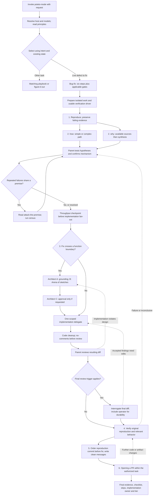
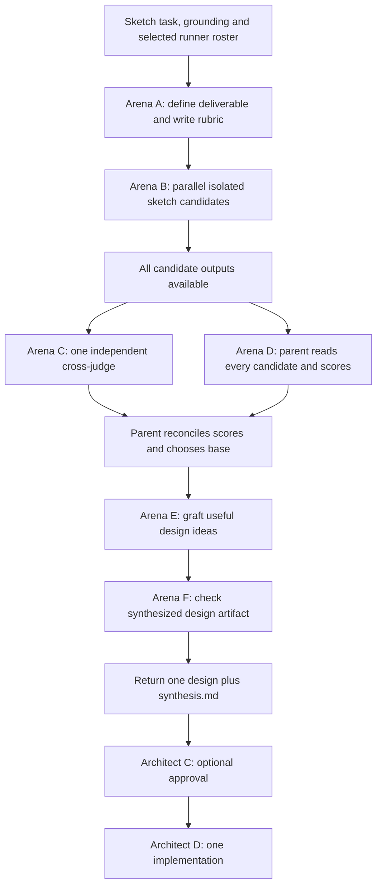

# Poteto mode: invocation-to-completion routing trace

This assessment follows the actual instruction dependencies, rather than counting installed files. It expands the user's bug-fix diagram against the current core skills, their reference prompts, the generated Claude/Codex/Copilot builds, and selected upstream files at the port's pinned revision `f8abeddd1862dc73704e3d719dd73df0d51b8c71`.

The diagram is a useful outline of one route. It is not a complete specification of that route. The current instructions contain additional calls, conditional branches, and return paths that affect both runtime and correctness. Some return paths remain ambiguous across files.

## What performs the routing

The parent agent reads `poteto-mode`, interprets the task, opens a playbook, and follows its instructions. A routed skill is another document the parent opens. The port does not execute a central function that automatically schedules every edge in this graph.

The parent must retain ownership of `how`, `why`, `architect`, `arena`, `interrogate`, and `swarm`. It delegates their individual explorer, investigator, candidate, judge, or implementation jobs. Handing a reviewer the entire `how` skill collapses a possible explore-then-explain pipeline into one delegate that cannot reliably spawn its own children.

Each actual delegate call also resolves the configured role, model, access, isolation, output location, and host capability degradation. Tier 2 is a possible resolution for the cited Claude run, not a universal entry condition for poteto-mode.

Sources: [router](../core/skills/poteto-mode/SKILL.md), [delegation protocol](../core/runtime/delegation.md), [worker persona](../core/agents/pstack-worker.md).

## Entry and selection

1. Load the router through the host's skill invocation. A mode-enabled engineering follow-up reaches it through the installed always-on instructions.
2. Resolve the generated host binding and any saved host profile; resolve model preferences when a role is used. Read the principles index and load relevant principle leaves when their trigger occurs.
3. Interpret the request using conversation and repository state. “Fix it so…” alone is not a sufficient classifier. A read-only constraint changes the route; work already fixed or landed goes through Session pickup; large or unmatched work uses figure-it-out; a standing multi-session program uses Orchestrate.
4. Open the selected playbook and copy its complete steps into the task list. Preserve skipped steps with reasons. For Bug fix, also retain the gates listed after its six numbered steps.
5. Apply the router's global triggers throughout execution. They are additional dependencies, not merely introductory advice.

The [guide](../core/docs/guide/02-poteto-mode.md) presents reading the principles before matching the task. The current router contains the index but does not explicitly make that read the first task-list item. Its task-list wording starts with the selected playbook's steps. These should be made consistent rather than treating the guide diagram as an exact rendering of the implementation.

There is also an entry inconsistency: the router says to read only the host binding up front and load other runtime files on demand; the generated `pstack-runtime/SKILL.md` says to read all seven runtime documents before the first step. The lazy path does not explicitly call the sticky-mode entry procedure, which is where writing `active: true` is documented. Direct invocation therefore lacks a single unambiguous path that both starts the workflow and persists the mode. `pstack on` provides an explicit alternative, but that does not resolve the instruction mismatch.

Sources: [router bootstrap and selectors](../core/skills/poteto-mode/SKILL.md), [runtime index generator](../build/build.mjs), [sticky mode](../core/runtime/sticky-mode.md).

## Expanded bug-fix route

The following diagram assembles the intended ordering from the named phases and temporal rules such as “before review” and “before commit.” It is not an assertion that a scheduler currently enforces this ordering. Dashed arrows identify return/invalidation behavior needed for a reliable composition; the current playbook does not define those transitions precisely.

The preparation and early failing evidence are pulled forward because downstream rules already depend on them. Opening a PR's worktree requirement cannot usefully wait until all edits are finished. Similarly, step 5's position is about commit ordering; it cannot mean “write and run the failing test for the first time after implementation.” Where the required reproduction is blocked, the correct output reports the unmet condition rather than following the diagram to a success claim.

The premise branch stops or changes the hypothesis when the census refutes the premise. It is not an instruction to repeatedly run the same census without new evidence.

## What is inside those boxes

| Route | Actual required behavior and return artifact |
|---|---|
| `how` | For a simple question, one explainer investigates and explains. For a complex question, 2–4 explorers work in parallel, then a separate explainer synthesizes all findings. Return a traced model. The no-delegation section currently prescribes 2–4 serial angles without explicitly preserving the simple-path exemption. |
| `why` | Parent builds a code/history anchor and discovers sources. Source-control investigation is the normal minimum; available additional categories receive investigators. A separate synthesizer receives findings, gaps, anchor, and epistemics. Return evidence with calibrated confidence and Preserve/Change/Avoid/Risk constraints for the fix. |
| Root-cause step | Parent uses runtime evidence to eliminate hypotheses and establish the actual mechanism. Merely receiving `how` and `why` reports does not complete this step. |
| `attack-the-premise` | Applies after two or more fixes based on the same premise fail the same gate. “Fourth fix” is task-specific context, not a mandatory stage or the general threshold. Produce the premise and rerunnable census before the next attempted fix. |
| Throughput checkpoint | Four items from Feature step 3: blocking prerequisites, independent workstreams, shared mutable state, and smallest safe decomposition. Keep non-applicable items with reasons. It should affect scheduling before delegates run. |
| Architect A | Calls `how` again on surrounding systems; also `why` when ownership/layering changes. There is no explicit instruction permitting reuse of equivalent caller grounding, except the greenfield skip. |
| Architect B | Calls Arena with a sketch brief, runner prompt, rationale template, and grounding. Candidates need structurally different starting designs; different stances alone are insufficient. A narrow empirical disagreement can justify one shared prototype experiment. |
| Architect C | Optional user approval of the already synthesized design. By default continue. This is not the synthesis phase. |
| Architect D/E | Implement the selected sketch, then watch for repeated design friction. If the architecture fails, re-ground, redesign, and return to sketching. In the bug-fix composition the implementation should be the same single delegated job required by bug-fix step 3. That caller/callee return boundary is not stated explicitly. |
| `no-comments` | One comment-sicko pass, then parent assessment. The reviewer can investigate constraints through inline `how`/`why`. The parent can run `how`/`why`, invoke Architect for a sketch, and implement accepted in-scope corrections. One rejected report may be retried; a second rejected report fails the skill. This is not necessarily a cheap comment deletion pass. |
| `interrogate` | A configured review panel, normally four entries, followed by parent synthesis and classification into Act on/Consider/Noted/Dismissed. It returns a verdict and does not auto-apply changes. The enclosing bug-fix run must decide how to address accepted blockers and obtain fresh proof. |
| Verification | Replay the original reproduction on the same interface. The current port freezes the harness at the failing-test commit; if it changes, report both original and changed harness results. Wrong-interface or inconclusive evidence is not a pass. |
| Opening a PR | Worktree and branch rules; ordered commits; code cleanup and no-comments; technical-writing and unslop; resolve forge; create a ready PR and inspect its status. A PR-opening subagent is additionally instructed to run interrogate. Opening a PR does not automatically start Babysit, Shipping, merge, or deployment. |
| Final response | Explain symptom, cause, fix, and actual failing/passing evidence. Include complete checklist/gate statuses, implementation owner/model, applied principles with decisions, and degradation. If a decision trail was required, show-me-your-work adds transcript audit and a trail-review delegate before handoff. |

Sources: [how](../core/skills/how/SKILL.md), [why](../core/skills/why/SKILL.md), [premise principle](../core/skills/principle-attack-the-premise/SKILL.md), [Feature checkpoint](../core/playbooks/feature.md), [Architect](../core/skills/architect/SKILL.md), [no-comments](../core/skills/no-comments/SKILL.md), [interrogate](../core/skills/interrogate/SKILL.md), [bug-fix](../core/playbooks/bug-fix.md), [Opening a PR](../core/playbooks/opening-a-pr.md), [show-me-your-work](../core/skills/show-me-your-work/SKILL.md).

## Arena must be expanded inside Architect B

“Three sketches” does not mean three delegates total. Arena adds a judge, and the parent must read and compare every candidate while that judge works. The design-stage verification checks the sketch's contract; the port explicitly postpones runtime proof of the implementation to Architect D. Arena F's generic verification language needs to preserve this artifact distinction.

There is an unresolved roster conflict: Architect names `architect-runners`; Arena's selection step independently names `arena-runners`. The setup defaults are three and four respectively. The intended caller override needs a defined input and precedence rule. The current documents leave the model to reconcile them.

## Specific corrections to the supplied diagram

| Supplied diagram | Correction |
|---|---|
| Bootstrap resolves Tier 2 | Resolve the actual host/session tier and role preferences. Tier 2 describes the cited run, not every invocation. |
| Go directly from bootstrap to match | Include the principles index and state-aware selection. Existing/landed fixes can redirect to Session pickup. |
| Six steps copied verbatim | Six steps plus the applicable global and bug-fix gates. Their listed position does not determine their execution time. |
| `how`: 2–4 explorers → explainer | Conditional. A narrow question goes directly to one explainer. |
| Always run attack-the-premise census | Conditional on repeated failed fixes sharing a premise. |
| Architect A is one small grounding box | It calls `how` again and may call `why`; this may duplicate the earlier investigation. |
| Three runners with different stances | Roster selection is unresolved; candidates must also differ structurally. |
| Architect Phase C synthesizes | Synthesis happens within Arena during Architect B. Architect C is opt-in approval. |
| Candidates → one implementation | Insert rubric, judge, parent read/score, base selection, grafting, design verification, and synthesis artifact. |
| Implementation → parent review | Account for the global no-comments trigger before review, including its potential further code changes. |
| Verification → commits → PR | Include conditional final-diff interrogate, code cleanup, writing requirements, and verification after any further code changes. |
| Failing test appears at step 5 | Capture it before the fix when practical; step 5 arranges history. The frozen-harness rule otherwise refers to a baseline not yet established. |
| Stop at Opening a PR | Finish with the evidence-bearing response and audit block. Babysit/merge are separate requested routes. |

## Actual composition defects to repair

1. **Bootstrap has two incompatible loading policies.** The router's lazy entry and the runtime index's eager entry are both generated. Mode activation is documented in a file the lazy path does not explicitly load. Choose one entry contract and invoke persistence there when appropriate.
2. **Caller inputs and return boundaries are underspecified.** Architect's roster must override Arena's roster for that invocation. Architect in a bug-fix step must not perform an implementation and then cause its caller to delegate a second implementation. This is an ambiguity risk, not a claim that every model duplicates the work.
3. **Grounding reuse is missing.** Bug-fix → how → Architect → how can reread unchanged scope. Define what evidence can be reused and what changes invalidate it.
4. **Temporal gates are appended after numbered steps that depend on them.** The bug-fix checklist puts gates after step 6, although they must execute before review, commit, or fan-out. An agent following list order can finish the numbered route too early.
5. **TDD is reached late in the numbered route.** TDD's own instructions require failure before edits; the frozen-harness rule also needs a stable pre-fix baseline. Separate establishing evidence from arranging commits.
6. **Cleanup can return changed code without a defined invalidation transition.** no-comments can investigate, redesign, and fix; PR preparation can also alter the artifact. Any prior verification or review affected by those changes must become stale. The prose asks for real proof but does not encode this return path.
7. **Review produces findings without a complete caller transition.** Interrogate explicitly does not apply changes. The bug-fix integration should define accepted findings → implementation → cleanup/review/verification, with a clear stop/report path for unresolved blockers.
8. **Leaf-job boundaries need consistent interpretation.** Workers read the full router but must perform only their assigned step and cannot delegate further. Their task briefs need explicit inputs, deliverables, and return points so they do not turn a leaf task into a serial recreation of the entire router.

The [upstream router](https://github.com/cursor/plugins/blob/f8abeddd1862dc73704e3d719dd73df0d51b8c71/pstack/skills/poteto-mode/SKILL.md) already contains broad design and cleanup triggers. The [upstream no-comments skill](https://github.com/cursor/plugins/blob/f8abeddd1862dc73704e3d719dd73df0d51b8c71/pstack/skills/no-comments/SKILL.md) already re-enters investigation and design. Thus some complexity is inherited from PSTACK itself. Our portable runtime and newly appended bug-fix gates add their own composition issues. Copying upstream exactly would not settle all of these questions.

## Why this can take much longer than the diagram suggests

An illustrative durable bug fix with simple `how` questions, only Git history available, Architect enabled, three sketch candidates, four final reviewers, and one cleanup pass implies:

| Work | Delegate calls |
|---|---:|
| Initial how explainer | 1 |
| Why investigator plus synthesizer | 2 |
| Architect's additional how explainer | 1 |
| Sketch candidates plus Arena judge | 4 |
| Implementation | 1 |
| Comment-sicko | 1 |
| Final interrogate panel | 4 |
| Total | 14 |

This is a conditional count derived from the instructions, not a measurement or a mandatory minimum. It excludes additional sources, complex explorers, retries, cleanup-triggered redesign, verification-skill creation, a PR-opening delegate, and trail review. Correctly following more internal stages can increase delegate count even while sketch-only candidates reduce each candidate's workload.

The historical run launched eight delegates. It cannot be treated as a conforming execution of this expanded current route: whole how/why jobs collapsed internal stages, four candidates produced implementations, and the previous audit reports missing final gates. The current corrections therefore need both a conformance check and a performance comparison; reducing candidate width alone does not establish the payoff.

## What is established by this trace

The main routing clauses above are present in all three generated builds: Claude, Codex, and Copilot. That includes the simple how branch, Architect's optional approval phase, Arena's own roster selection, the no-comments design branch, bug-fix gates, and the explicit prohibition on automatic babysitting after PR creation. Their presence confirms that the composition issues are shared instruction issues rather than only a missing Claude file.

No engineering workflow was launched and no runtime behavior was certified in this follow-up. The deliverable is this source-backed routing trace. Product instructions were not modified. The next implementation work should make the entry policy, caller inputs, return artifacts, gate timing, evidence invalidation, and terminal states explicit, then replay a representative bug-fix route to verify that the actual execution follows them.
