# PSTACK execution atlas

Snapshot of the implementation in this repository on 2026-09-12, after the fix rounds of 2026-09-11 and 2026-09-12. Those rounds made the mode block a single canonical text that `pstack on` restores; recorded install scope, backups before replacement and their restoration on uninstall or host switch; tightened the completion contracts (conditional review gates, `skip_with`, `skip_reasons`, the three-word parent note, `--through` scoping, a single declared `reroute`, and a run-less Pause safely); moved run records to the repository's main checkout with a per-run workspace and content-based freshness; stated that every Architect caller stops it after Phase C; rewrote Orchestrate around depth-one delegation with an optional Graphite frontier; removed the landing boilerplate from Babysit and Autopilot-stack; added runner, Copilot and manual paths to Benny; and extended the worktree audit and plan checker. This revision redraws the affected diagrams, marks what the recorder enforces in code versus what the prose only instructs, and re-evaluates the source limits at the end.

This atlas describes the source currently present here. It does not reconstruct a particular Claude, Codex or Copilot session and does not certify that every host executed these instructions successfully. All 23 bundled playbooks have their own diagram. Shared skills, activation, helper code and optional automation have additional diagrams.

**Read first:** diagrams 01–06 explain the components, activation, selection and delegation. Diagram 10 follows a live bug from invocation to the reply. Diagram 34 explains why the observer is evidence of recorded work rather than a workflow executor.

**How to read the arrows:** a solid arrow is the source's stated sequence or a code dependency. A branch is conditional. Dotted arrows provide supporting context, a side process, or a handoff obligation. Parallel branches run concurrently only if the actual host supports it. A diagram can describe agent instructions without those instructions being programmatically enforced. Where a label says `Code:`, `rr check` enforces it; everything else is an instruction the agent follows or skips.

**Execution boundary:** repository instructions cannot supply tools or permissions absent from the host, override the user's scope, or override higher-priority host instructions. This atlas documents requested behavior without granting authority to perform the external actions shown.

## Diagram index

- [01. The parts that actually execute](#diagram-01)
- [02. Install, configure, and turn the mode on](#diagram-02)
- [03. What happens on each turn while mode is on](#diagram-03)
- [04. How the playbook is selected](#diagram-04)
- [05. The common playbook wrapper and conditional gates](#diagram-05)
- [06. How a delegate becomes a host call](#diagram-06)
- [07. how: explain mechanism](#diagram-07)
- [08. why: investigate rationale and regression history](#diagram-08)
- [09. Architect and its Arena of sketches](#diagram-09)
- [10. Bug fix: live defect to verified PR](#diagram-10)
- [11. Feature: new or changed behavior](#diagram-11)
- [12. Investigation: a question without a code change](#diagram-12)
- [13. Session pickup: resume existing work or inspect an existing fix](#diagram-13)
- [14. Pause safely: stop without losing the resume point](#diagram-14)
- [15. Refactoring: change structure while preserving behavior](#diagram-15)
- [16. Prototype: settle an empirical or visual decision](#diagram-16)
- [17. Perf issue: one measured performance fix](#diagram-17)
- [18. Hillclimb: repeat controlled experiments on one metric](#diagram-18)
- [19. Runtime forensics: diagnose a live process](#diagram-19)
- [20. Trace forensics: diagnose an already-captured artifact](#diagram-20)
- [21. Visual parity: migrate without changing pixels](#diagram-21)
- [22. Authoring a skill: instructions are the artifact](#diagram-22)
- [23. Eval: compare workflow or prompt variants](#diagram-23)
- [24. Babysit: PR status, review comments, or merge-readiness](#diagram-24)
- [25. Shipping: independently verify and land from the bottom](#diagram-25)
- [26. Autonomous run: one task until a predicate holds](#diagram-26)
- [27. figure-it-out: design a bespoke workflow](#diagram-27)
- [28. Multi-phase plan: produce the plan and stop](#diagram-28)
- [29. Orchestrate: a standing program with a queue and ledger](#diagram-29)
- [30. Autopilot-full: independent owners build and merge](#diagram-30)
- [31. Autopilot-stack: build and verify, then operator lands](#diagram-31)
- [32. Worktree cleanup: disk reclamation with usage checks](#diagram-32)
- [33. Opening a PR: the shared shipping-preparation subroutine](#diagram-33)
- [34. Run records, completion checks, and the live observer](#diagram-34)
- [35. Benny setup: optional automation has its own entry path](#diagram-35)
- [36. Benny triage: classify and route a report, without fixing](#diagram-36)
- [37. Benny repro: trusted marker to bounded draft fix](#diagram-37)
- [38. Direct skills: there is no mandatory poteto-mode wrapper](#diagram-38)
- [39. Swarm: coverage or a race, without Arena synthesis](#diagram-39)
- [40. Cleanup and review are different workflows](#diagram-40)
- [41. Verification skills connect the workflow to the actual product](#diagram-41)

<a id="diagram-01"></a>

## 01. The parts that actually execute

The host agent is the executor. Most PSTACK behavior is Markdown that the agent reads and follows. The build produces host-specific instructions; it does not compile them into an autonomous task scheduler. Solid arrows show a dependency or instructed sequence, not proof that a session executed it. Dotted arrows show observation. pstack serve does not display the code under change, though rerunning the check hashes the working tree of the checkout to judge freshness. It reads the host session stores, finds run records through the same record directories run-record.py searches, checks each run against the checkout that holds its record, and shows artifact files that session activity references. The observer's contract documents that lookup and its time-link rule.

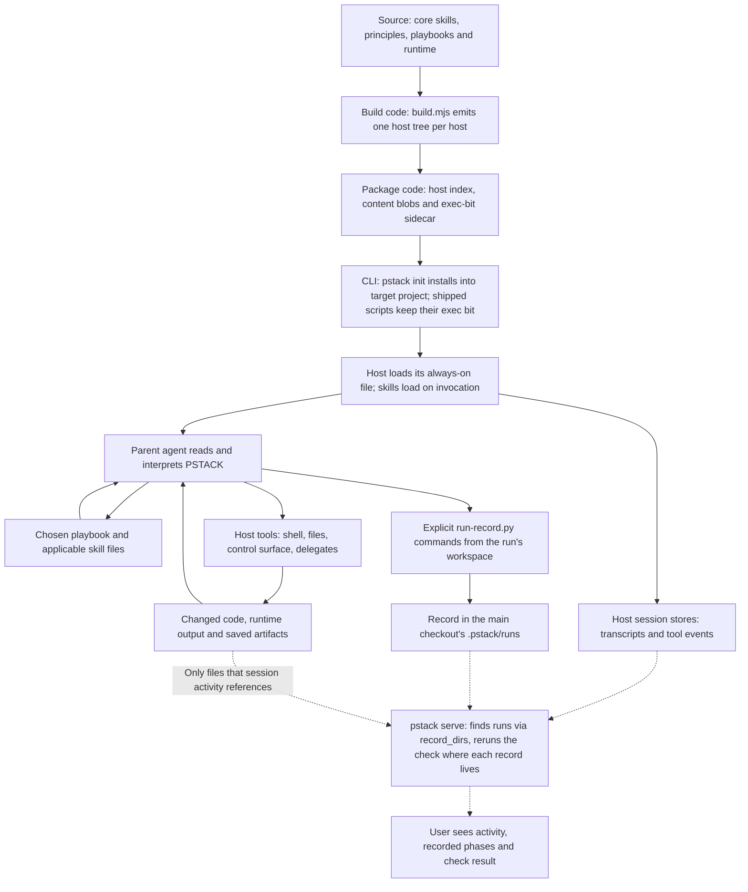

Source: [build/build.mjs:419](../build/build.mjs#L419), [build/package.py:30](../build/package.py#L30), [build/package.py:50](../build/package.py#L50), [packaging/src/pstack_cli/cli.py:110](../packaging/src/pstack_cli/cli.py#L110), [core/runtime/delegation.md:181](../core/runtime/delegation.md#L181), [core/skills/poteto-mode/SKILL.md:188](../core/skills/poteto-mode/SKILL.md#L188), [packaging/src/pstack_cli/observe/server.py:166](../packaging/src/pstack_cli/observe/server.py#L166), [packaging/src/pstack_cli/observe/runs.py:202](../packaging/src/pstack_cli/observe/runs.py#L202), [packaging/src/pstack_cli/observe/runs.py:219](../packaging/src/pstack_cli/observe/runs.py#L219), [core/skills/poteto-mode/scripts/run-record.py:1137](../core/skills/poteto-mode/scripts/run-record.py#L1137), [packaging/src/pstack_cli/observe/CONTRACT.md:124](../packaging/src/pstack_cli/observe/CONTRACT.md#L124), [packaging/src/pstack_cli/observe/trace.py:1](../packaging/src/pstack_cli/observe/trace.py#L1).

<a id="diagram-02"></a>

## 02. Install, configure, and turn the mode on

These are separate operations. init copies files, backs up any file you wrote or edited before replacing it and lists the files it backed up (the first eight by name, then a count of the rest), sets the exec bit on shipped scripts (update also fixes installs made without it, and a replaced file of yours keeps your mode), merges the mode block, and creates inactive mode state only when none exists. The receipt records whether the install is project or user scope. A user-level install skips docs/, automations/, assets/, USAGE.md, REFERENCE.md, .claude-plugin/ and the instructions file, and retires earlier copies of them; because the mode is per project, pstack on and pstack off both decline there. An instructions file that links outside the project is left alone. Switching hosts saves and restores host profiles, retires the old host's files and puts backups back; at a user root it never touches the home instructions file. setup-pstack is an agent workflow that probes capabilities and writes configuration; it runs pstack doctor right after host.json, before models.md. pstack on restores the mode block first, then sets active: true; if the block cannot be written, the mode stays as it was. It does not start a model run. Uninstall removes what pstack wrote and puts backups back, dropping a backup that differs from the current file only by pstack text; --purge keeps .pstack/runs unless --delete-runs is also given.

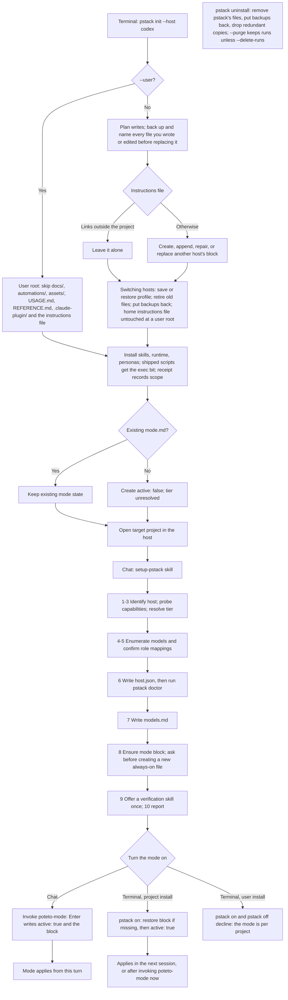

Source: [packaging/src/pstack_cli/cli.py:110](../packaging/src/pstack_cli/cli.py#L110), [packaging/src/pstack_cli/cli.py:86](../packaging/src/pstack_cli/cli.py#L86), [packaging/src/pstack_cli/cli.py:92](../packaging/src/pstack_cli/cli.py#L92), [packaging/src/pstack_cli/hosts.py:28](../packaging/src/pstack_cli/hosts.py#L28), [packaging/src/pstack_cli/installer.py:59](../packaging/src/pstack_cli/installer.py#L59), [packaging/src/pstack_cli/installer.py:64](../packaging/src/pstack_cli/installer.py#L64), [packaging/src/pstack_cli/installer.py:128](../packaging/src/pstack_cli/installer.py#L128), [packaging/src/pstack_cli/installer.py:206](../packaging/src/pstack_cli/installer.py#L206), [packaging/src/pstack_cli/installer.py:252](../packaging/src/pstack_cli/installer.py#L252), [packaging/src/pstack_cli/installer.py:330](../packaging/src/pstack_cli/installer.py#L330), [packaging/src/pstack_cli/installer.py:548](../packaging/src/pstack_cli/installer.py#L548), [packaging/src/pstack_cli/cli.py:369](../packaging/src/pstack_cli/cli.py#L369), [packaging/src/pstack_cli/cli.py:377](../packaging/src/pstack_cli/cli.py#L377), [packaging/src/pstack_cli/cli.py:410](../packaging/src/pstack_cli/cli.py#L410), [packaging/src/pstack_cli/installer.py:371](../packaging/src/pstack_cli/installer.py#L371), [packaging/src/pstack_cli/installer.py:581](../packaging/src/pstack_cli/installer.py#L581), [packaging/src/pstack_cli/installer.py:607](../packaging/src/pstack_cli/installer.py#L607), [packaging/src/pstack_cli/cli.py:602](../packaging/src/pstack_cli/cli.py#L602), [build/package.py:50](../build/package.py#L50), [core/skills/setup-pstack/SKILL.md:88](../core/skills/setup-pstack/SKILL.md#L88), [core/skills/setup-pstack/SKILL.md:115](../core/skills/setup-pstack/SKILL.md#L115), [core/skills/setup-pstack/SKILL.md:120](../core/skills/setup-pstack/SKILL.md#L120), [core/skills/setup-pstack/SKILL.md:148](../core/skills/setup-pstack/SKILL.md#L148), [core/runtime/sticky-mode.md:56](../core/runtime/sticky-mode.md#L56), [core/skills/poteto-mode/SKILL.md:23](../core/skills/poteto-mode/SKILL.md#L23).

<a id="diagram-03"></a>

## 03. What happens on each turn while mode is on

Mode state is project-local. It tells a cooperating host agent to route engineering turns. It is not a background daemon. The mode block has one canonical text in sticky-mode.md, with the host runtime path filled in by the build. poteto-mode is marked manual-invoke in the Claude, Codex, Copilot and Cursor builds, so the host does not auto-load it on a matching request. Without an explicit invocation or an active mode block, a request for rigor reaches the router only if the agent chooses to open it after reading the always-on entry text. Copilot has a second entry: the pstack custom agent in .github/agents carries no user-invocable: false, so the user can pick it, and it starts at poteto-mode. The generic build writes its block to pstack/AGENTS.md, which no host loads automatically. A playbook field in mode.md does not lock later requests to that playbook.

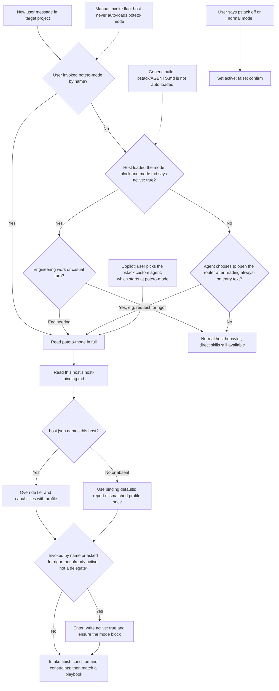

Source: [core/runtime/sticky-mode.md:15](../core/runtime/sticky-mode.md#L15), [build/build.mjs:340](../build/build.mjs#L340), [core/skills/poteto-mode/SKILL.md:23](../core/skills/poteto-mode/SKILL.md#L23), [core/skills/poteto-mode/SKILL.md:45](../core/skills/poteto-mode/SKILL.md#L45), [build/build.mjs:136](../build/build.mjs#L136), [build/build.mjs:219](../build/build.mjs#L219), [build/build.mjs:265](../build/build.mjs#L265), [build/build.mjs:460](../build/build.mjs#L460), [packaging/src/pstack_cli/hosts.py:60](../packaging/src/pstack_cli/hosts.py#L60), [dist/codex/AGENTS.md:5](../dist/codex/AGENTS.md#L5), [build/build.mjs:690](../build/build.mjs#L690), [dist/copilot/.github/agents/pstack.agent.md:2](../dist/copilot/.github/agents/pstack.agent.md#L2).

<a id="diagram-04"></a>

## 04. How the playbook is selected

This is a semantic decision by the parent agent using the router text. There is no Python request classifier, keyword dispatcher, or fixed priority score. routes.json holds phase descriptions after selection. The branches below group the written matching rules; they are not a newly invented precedence algorithm. The source explicitly prioritizes Session pickup for already-landed work, figure-it-out for broad bespoke runs, and Orchestrate for standing programs. Opening a PR is not a user-selectable outcome. The router invokes it at the end of playbooks that ship a code change and for each PR that Autonomous run, Orchestrate and the Autopilots open.

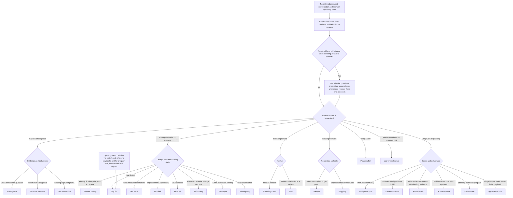

Source: [core/skills/poteto-mode/SKILL.md:184](../core/skills/poteto-mode/SKILL.md#L184), [core/skills/poteto-mode/SKILL.md:196](../core/skills/poteto-mode/SKILL.md#L196), [core/skills/poteto-mode/SKILL.md:70](../core/skills/poteto-mode/SKILL.md#L70), [core/skills/poteto-mode/SKILL.md:67](../core/skills/poteto-mode/SKILL.md#L67), [core/skills/poteto-mode/SKILL.md:220](../core/skills/poteto-mode/SKILL.md#L220), [build/gen-routes.py:173](../build/gen-routes.py#L173), [core/skills/poteto-mode/scripts/run-record.py:652](../core/skills/poteto-mode/scripts/run-record.py#L652).

<a id="diagram-05"></a>

## 05. The common playbook wrapper and conditional gates

The playbook gives the main steps. The router adds gates when their triggers apply; all 23 principles are not sequential tasks. Only applied principle leaves are read and cited. tasks --json exports the checklist, phase ids, states and requirements from the record. For numbered playbooks and Bug fix the checklist text is the playbook steps; Opening a PR has no numbered steps, so its text is the generated phase labels. Recording a phase start before its work is an instruction. The code requires a started attempt to attach evidence or a delegate with --phase, to record --fail or --block, and in a parent before any child phase; only --done passes without a start. A failing check means continuing the work or reporting the unmet conditions, never calling the run complete. Exceptions such as Investigation and Prototype have their own terminal deliverables.

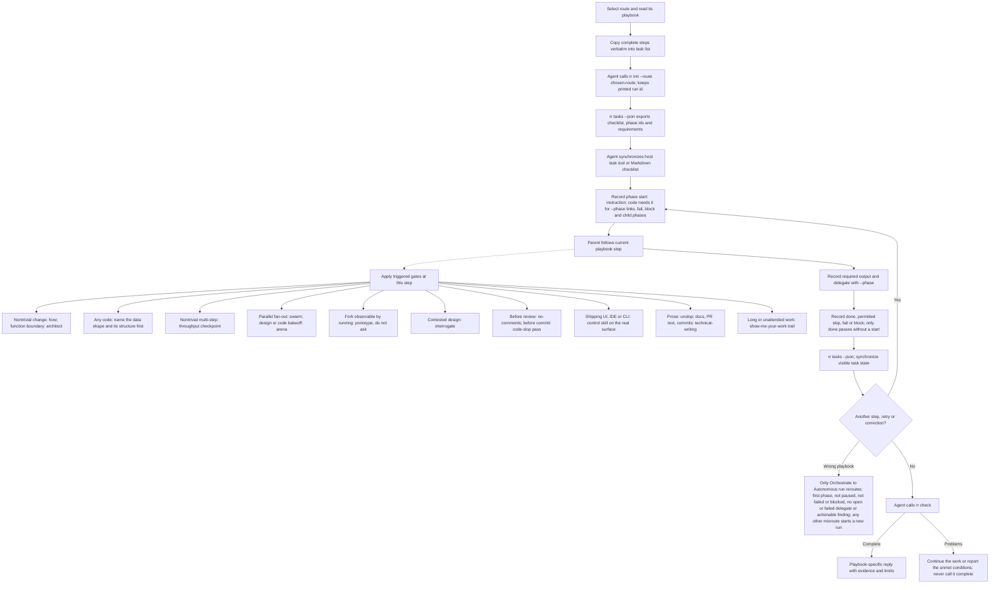

Source: [core/skills/poteto-mode/SKILL.md:56](../core/skills/poteto-mode/SKILL.md#L56), [core/skills/poteto-mode/SKILL.md:61](../core/skills/poteto-mode/SKILL.md#L61), [core/skills/poteto-mode/SKILL.md:72](../core/skills/poteto-mode/SKILL.md#L72), [core/skills/poteto-mode/SKILL.md:186](../core/skills/poteto-mode/SKILL.md#L186), [core/skills/poteto-mode/SKILL.md:190](../core/skills/poteto-mode/SKILL.md#L190), [core/skills/poteto-mode/SKILL.md:192](../core/skills/poteto-mode/SKILL.md#L192), [build/gen-routes.py:192](../build/gen-routes.py#L192), [core/skills/poteto-mode/scripts/run-record.py:738](../core/skills/poteto-mode/scripts/run-record.py#L738), [core/skills/poteto-mode/scripts/run-record.py:766](../core/skills/poteto-mode/scripts/run-record.py#L766), [core/skills/poteto-mode/scripts/run-record.py:773](../core/skills/poteto-mode/scripts/run-record.py#L773), [core/skills/poteto-mode/scripts/run-record.py:924](../core/skills/poteto-mode/scripts/run-record.py#L924), [core/skills/poteto-mode/SKILL.md:194](../core/skills/poteto-mode/SKILL.md#L194).

<a id="diagram-06"></a>

## 06. How a delegate becomes a host call

Role configuration is interpreted by the agent from models.md, roles.md and host-binding.md. The port does not provide a universal function that launches all vendors. The persona controls the job boundary; the model role controls the requested strength. Tier 3 needs different model families, so Claude Code and Codex stop at Tier 2; only Cursor and a VS Code Copilot session with subagents enabled and a top-cost-tier parent model reach it, and Copilot's own delegates run at Tier 0. The generic build runs at Tier 0 until a spawn succeeds. One retry is prose everywhere, and the run recorder refuses a third attempt when delegates are recorded. Current host labels and defaults describe this checkout, not a fresh verification of vendor APIs.

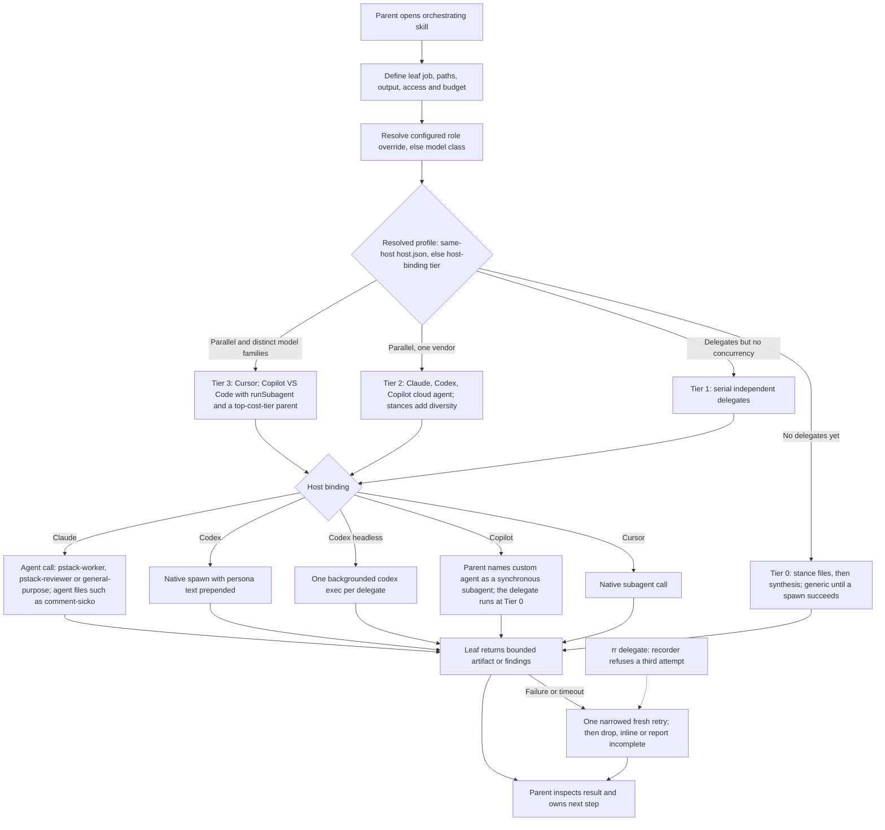

Source: [core/runtime/delegation.md:18](../core/runtime/delegation.md#L18), [core/runtime/delegation.md:81](../core/runtime/delegation.md#L81), [core/runtime/delegation.md:107](../core/runtime/delegation.md#L107), [core/runtime/delegation.md:131](../core/runtime/delegation.md#L131), [core/runtime/delegation.md:171](../core/runtime/delegation.md#L171), [core/runtime/delegation.md:255](../core/runtime/delegation.md#L255), [core/runtime/host-profile.md:25](../core/runtime/host-profile.md#L25), [build/build.mjs:709](../build/build.mjs#L709), [dist/copilot/.github/skills/pstack-runtime/host-binding.md:12](../dist/copilot/.github/skills/pstack-runtime/host-binding.md#L12), [core/skills/poteto-mode/scripts/run-record.py:82](../core/skills/poteto-mode/scripts/run-record.py#L82), [core/runtime/roles.md:25](../core/runtime/roles.md#L25).

<a id="diagram-07"></a>

## 07. how: explain mechanism

The parent runs the skill and gives each delegate one leaf job. Complex mode adds explorers before one explainer. Default model roles are fast explorers and a deep explainer. This produces grounding, not confirmation that a bug hypothesis is true.

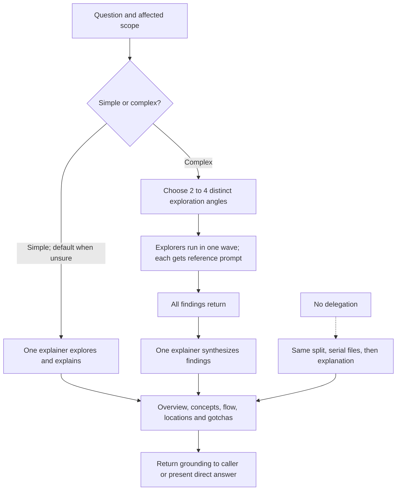

Source: [core/skills/how/SKILL.md:10](../core/skills/how/SKILL.md#L10), [core/skills/how/SKILL.md:39](../core/skills/how/SKILL.md#L39).

<a id="diagram-08"></a>

## 08. why: investigate rationale and regression history

Evidence categories depend on available sources. Missing integrations become reported gaps. The skill does not require seven working integrations before it can return an answer. Source control is the baseline category, though its assertion that gh is always available is an environment assumption, not a dependency installer. Without delegation the same categories run one at a time, each written to its own file. Inside step 3, after discovery, a trivial single-commit target whose PR already holds the answer may be answered inline, but only after confirming that all seven available category searches would be redundant, and saying so.

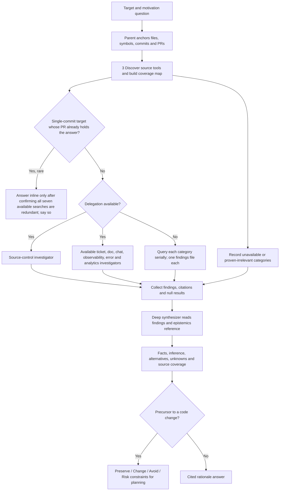

Source: [core/skills/why/SKILL.md:16](../core/skills/why/SKILL.md#L16), [core/skills/why/SKILL.md:55](../core/skills/why/SKILL.md#L55), [core/skills/why/SKILL.md:63](../core/skills/why/SKILL.md#L63), [core/skills/why/SKILL.md:67](../core/skills/why/SKILL.md#L67), [core/skills/why/SKILL.md:126](../core/skills/why/SKILL.md#L126), [core/skills/why/SKILL.md:128](../core/skills/why/SKILL.md#L128), [core/skills/why/SKILL.md:151](../core/skills/why/SKILL.md#L151).

<a id="diagram-09"></a>

## 09. Architect and its Arena of sketches

Architect may reuse current grounding. Its runner roster is architect-runners, which overrides arena-runners for this invocation. At least two structurally distinct candidates are required; setup suggests three. Candidates are sketches, not running code, except for one narrow experiment on a question no sketch can settle. The cross-judge starts after candidates finish, alongside the parent reading them. Every candidate is screened against the design red flags before synthesis. Phase C approval is opt-in, and human pushback sends the work back to grounding. Bug fix step 3, Feature step 2, Refactoring step 3, Perf issue step 3, figure-it-out Phase B and no-comments stop Architect after Phase C and own implementation.

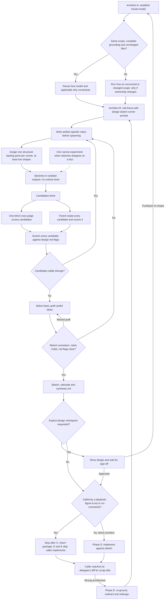

Source: [core/skills/architect/SKILL.md:22](../core/skills/architect/SKILL.md#L22), [core/skills/architect/SKILL.md:37](../core/skills/architect/SKILL.md#L37), [core/skills/architect/SKILL.md:54](../core/skills/architect/SKILL.md#L54), [core/skills/architect/SKILL.md:63](../core/skills/architect/SKILL.md#L63), [core/skills/architect/SKILL.md:67](../core/skills/architect/SKILL.md#L67), [core/skills/architect/SKILL.md:81](../core/skills/architect/SKILL.md#L81), [core/skills/architect/SKILL.md:89](../core/skills/architect/SKILL.md#L89), [core/skills/arena/SKILL.md:35](../core/skills/arena/SKILL.md#L35), [core/skills/arena/SKILL.md:57](../core/skills/arena/SKILL.md#L57), [core/skills/arena/SKILL.md:77](../core/skills/arena/SKILL.md#L77), [core/skills/arena/SKILL.md:89](../core/skills/arena/SKILL.md#L89).

<a id="diagram-10"></a>

## 10. Bug fix: live defect to verified PR

This is the most explicitly instrumented playbook. Six numbered steps expand into nine recorded phases. how and why supply hypotheses; the parent confirms the mechanism by running the system. Labels mark what rr check enforces. Four phases are mandatory gates: reproduce, root-cause (its confirm child must be done), implement (a returned implement delegate, or a note whose text after `parent:` has at least three words) and verify (a current passing verification). Review is conditional and takes a skip with a reason. Plan, cleanup, commits and open-pr carry no gate, so the checker accepts done or a skip with a reason there; a failed or blocked outcome is still reported. The contract is unordered: only five named pairs are ordered. The worktree rule is an instruction: a record started before the worktree existed moves into it with rr workspace --path . before any evidence, and the recorder then refuses record commands from any other checkout. The recorder also refuses any output saved in the tree outside .pstack, so the failing-check output goes under .pstack/runs/run-id/ or outside the tree.

```mermaid
flowchart TD
    IN["Live defect selected; task list and bug-fix record created"] --> R["1 Reproduce on real surface via control skill"]
    R --> WT["Gate, prose: worktree off main before first edit; rr workspace --path . before evidence; name the driver"]
    WT --> FCK["Executable failing check; commit it alone; save output under .pstack/runs"]
    FCK -->|Will not fail for the bug's reason| STOPR["Stop and report the unmet condition"]
    FCK --> RB["rr baseline and repro fail. Code: committed harness, repro on baseline tree, ancestor of HEAD"]
    RB --> H["2 how: mechanism grounding"]
    RB --> W["2 why: history and constraints"]
    H --> M["root-cause/confirm: parent tests hypotheses at runtime. Code: required child"]
    W --> M
    M --> CEN{"Two fixes on one premise failed the same gate?"}
    CEN -->|Yes| CENSUS["Read attack-the-premise; write census; revise hypotheses if refuted"]
    CENSUS --> M
    CEN -->|No, or census resolved| PLAN["3 Throughput checkpoint and plan. Code: outcome only"]
    PLAN --> CROSS{"Crosses a function boundary?"}
    CROSS -->|Yes| ARC["Architect A to C: sketches compared on shape; full arena of running candidates only when no sketch can settle it"]
    CROSS -->|No| SKIP["plan skip with reason"]
    ARC --> DLG{"Can this agent delegate?"}
    SKIP --> DLG
    DLG -->|Yes| IMP["One implementation delegate, deep default. Code: returned implement job"]
    DLG -->|No, Tier 0| PAR["Parent implements; note 'parent: limitation', three words or more after parent:"]
    IMP --> CLEAN["Code-slop pass, no-comments, parent review. Code: outcome only"]
    PAR --> CLEAN
    IMP -->|Violates selected design| ARC
    CLEAN --> TRIG{"Synthesized fix, durable state, retries or failure handling?"}
    TRIG -->|Yes| REV["Interrogate final diff with operator stance. Code: review pass; act findings resolved"]
    TRIG -->|No| RSKIP["review skip with reason"]
    REV -->|Accepted finding| IMP
    REV -->|No unresolved blocker| V["4 Verify frozen repro on final code. Code: current pass; original harness too if edited"]
    RSKIP --> V
    V -->|Fail or inconclusive| M
    V -->|Pass| K["5 Failing-check commit before fix; technical-writing. Code: outcome only"]
    K --> CK["rr check --through commits"]
    CK -->|No reported problem| PR["6 Opening a PR"]
    PR -->|Preparation changes code or harness| V
    PR -->|Ready PR created| FINAL["rr check; unslop; evidence and audit block"]
    ORD["Order checked only for: reproduce before root-cause and implement; plan, implement, cleanup, review in sequence"] -.-> CK
```

Source: [core/playbooks/bug-fix.md:9](../core/playbooks/bug-fix.md#L9), [core/playbooks/bug-fix.md:14](../core/playbooks/bug-fix.md#L14), [core/playbooks/bug-fix.md:15](../core/playbooks/bug-fix.md#L15), [core/playbooks/bug-fix.md:16](../core/playbooks/bug-fix.md#L16), [core/playbooks/bug-fix.md:23](../core/playbooks/bug-fix.md#L23), [core/playbooks/bug-fix.md:25](../core/playbooks/bug-fix.md#L25), [core/playbooks/bug-fix.md:27](../core/playbooks/bug-fix.md#L27), [core/playbooks/bug-fix.md:32](../core/playbooks/bug-fix.md#L32), [build/route-contracts.json:7](../build/route-contracts.json#L7), [core/playbooks/bug-fix.md:21](../core/playbooks/bug-fix.md#L21), [core/skills/poteto-mode/scripts/run-record.py:69](../core/skills/poteto-mode/scripts/run-record.py#L69), [core/skills/poteto-mode/scripts/run-record.py:1008](../core/skills/poteto-mode/scripts/run-record.py#L1008), [core/skills/poteto-mode/scripts/run-record.py:1075](../core/skills/poteto-mode/scripts/run-record.py#L1075), [core/skills/poteto-mode/scripts/run-record.py:1163](../core/skills/poteto-mode/scripts/run-record.py#L1163), [core/skills/poteto-mode/scripts/run-record.py:1188](../core/skills/poteto-mode/scripts/run-record.py#L1188).

<a id="diagram-11"></a>

## 11. Feature: new or changed behavior

Feature orders how, design, decomposition, implementation and real-surface verification. Architect runs as a caller-owned design step: it stops after Phase C and the step 4 delegate is its Phase D, so the design is implemented once. Step 4 invokes Arena when multiple valid implementation shapes warrant comparison, a working-artifact Arena distinct from Architect sketches. The record gates step 4 (a returned delegate, or a parent note when this agent cannot delegate), step 5 (current passing verification) and step 7 (a passing review, or a skip when the design is not contested). Steps 1, 2, 3, 6 and 8 carry no gate, so the checker accepts a skip with a reason there. Gated evidence and delegate returns count only when recorded with --phase for that step; Bug fix's verify, review and implement phases are the ones that also accept unphased entries. A review recorded without --phase cannot be scoped to step 7, so skipping step 7 does not clear a failing one. Feature is an ordered route.

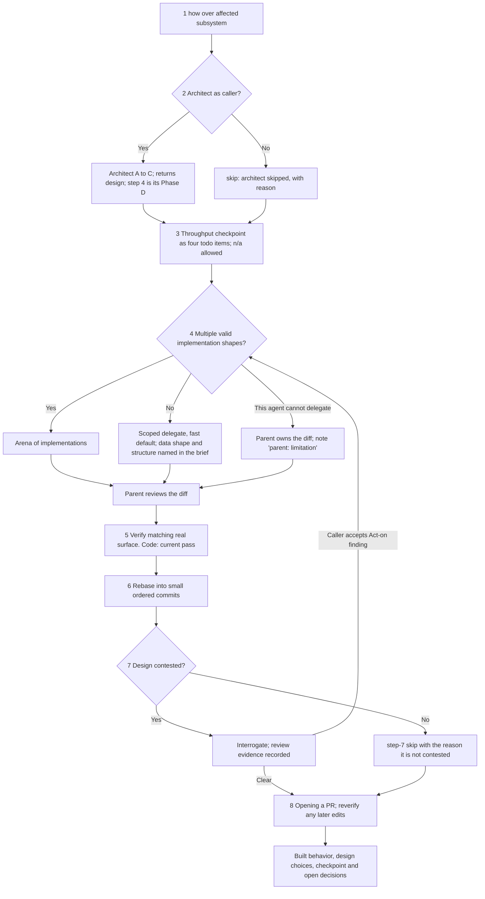

Source: [core/playbooks/feature.md:6](../core/playbooks/feature.md#L6), [core/playbooks/feature.md:7](../core/playbooks/feature.md#L7), [core/playbooks/feature.md:12](../core/playbooks/feature.md#L12), [core/playbooks/feature.md:16](../core/playbooks/feature.md#L16), [core/skills/interrogate/SKILL.md:94](../core/skills/interrogate/SKILL.md#L94), [core/playbooks/opening-a-pr.md:33](../core/playbooks/opening-a-pr.md#L33), [build/route-contracts.json:9](../build/route-contracts.json#L9), [core/skills/poteto-mode/scripts/run-record.py:995](../core/skills/poteto-mode/scripts/run-record.py#L995), [core/skills/poteto-mode/scripts/run-record.py:1054](../core/skills/poteto-mode/scripts/run-record.py#L1054).

<a id="diagram-12"></a>

## 12. Investigation: a question without a code change

Example: explain how our routing works. The deliverable is an explanation or recommendation. This playbook explicitly excludes PR creation, Babysit and Architect. Read-only is an instruction; the record gates only step 3, which needs the saved explanation or recommendation as an artifact. When the investigation precedes a code change, the playbook hands back to the user before re-routing to Bug fix or Feature.

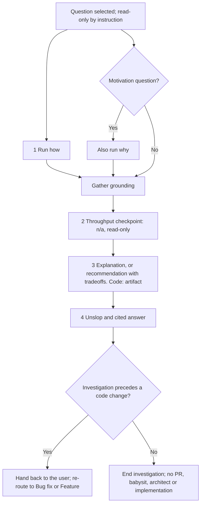

Source: [core/playbooks/investigation.md:5](../core/playbooks/investigation.md#L5), [core/playbooks/investigation.md:9](../core/playbooks/investigation.md#L9), [core/playbooks/investigation.md:12](../core/playbooks/investigation.md#L12), [build/route-contracts.json:11](../build/route-contracts.json#L11).

<a id="diagram-13"></a>

## 13. Session pickup: resume existing work or inspect an existing fix

The router directs an already-fixed symptom here instead of treating it as a new bug. The source says to preserve prior work and also verify inherited claims on the real artifact. Step 5 always follows step 4 before the routed playbook takes over, and the record makes that verification mandatory and requires a step 3 artifact. Copilot transcripts are partial: VS Code chat sessions are readable, Copilot CLI session state is unverified, and the GitHub.com coding agent keeps none, so the trail there may be a cloud-agent URL, a pushed branch, or the repository record. Continuing under the routed playbook starts a new run, because only Orchestrate declares a reroute.

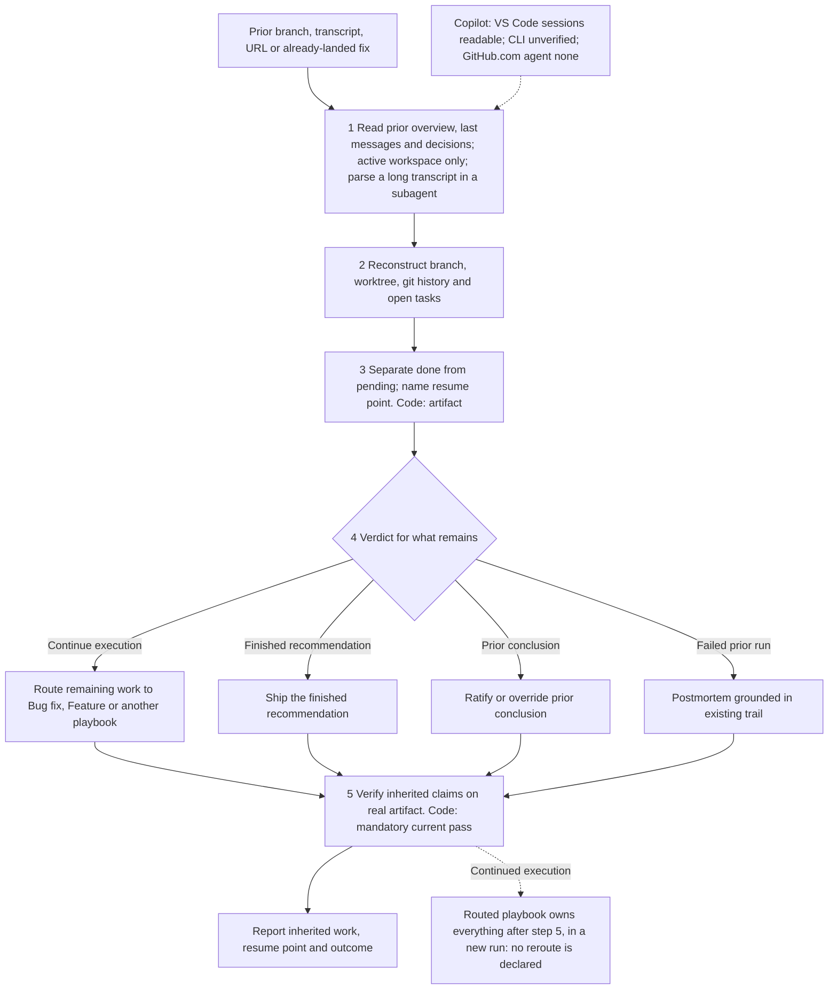

Source: [core/playbooks/session-pickup.md:5](../core/playbooks/session-pickup.md#L5), [core/playbooks/session-pickup.md:8](../core/playbooks/session-pickup.md#L8), [core/playbooks/session-pickup.md:9](../core/playbooks/session-pickup.md#L9), [core/skills/poteto-mode/SKILL.md:70](../core/skills/poteto-mode/SKILL.md#L70), [core/skills/poteto-mode/SKILL.md:190](../core/skills/poteto-mode/SKILL.md#L190), [core/runtime/host-profile.md:15](../core/runtime/host-profile.md#L15), [build/route-contracts.json:20](../build/route-contracts.json#L20).

<a id="diagram-14"></a>

## 14. Pause safely: stop without losing the resume point

This path is for an actual stop: an explicit pause, going offline, a host restart, or imminent context compaction. Going to bed while asking the agent to continue is explicitly not a pause request. With a run record, Pause safely works in the task's run and starts no run of its own. It records each cancelled delegate, closes the current phase (done, or blocked with a paused reason), and finishes with rr pause --next. A paused run refuses phase entries, and check reports it incomplete with the resume point, which is the honest state of a pause. rr pause does not cancel any host agent. A delegate recorded cancelled ends that attempt and uses one of its two, so after resume check asks to retry it or record it dropped. Later, rr resume only restores the run, and --start picks the blocked attempt back up. Its contract says run: false, so init --route pause-safely is refused.

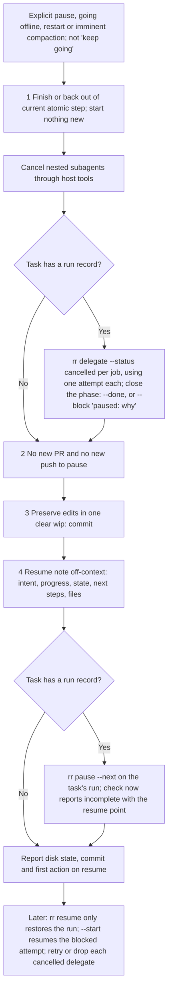

Source: [core/playbooks/pause-safely.md:3](../core/playbooks/pause-safely.md#L3), [core/playbooks/pause-safely.md:5](../core/playbooks/pause-safely.md#L5), [core/playbooks/pause-safely.md:8](../core/playbooks/pause-safely.md#L8), [core/skills/poteto-mode/SKILL.md:188](../core/skills/poteto-mode/SKILL.md#L188), [core/skills/poteto-mode/references/session-tracking.md:20](../core/skills/poteto-mode/references/session-tracking.md#L20), [core/runtime/delegation.md:266](../core/runtime/delegation.md#L266), [core/skills/poteto-mode/SKILL.md:217](../core/skills/poteto-mode/SKILL.md#L217), [build/route-contracts.json:15](../build/route-contracts.json#L15), [core/skills/poteto-mode/scripts/run-record.py:653](../core/skills/poteto-mode/scripts/run-record.py#L653), [core/skills/poteto-mode/scripts/run-record.py:1094](../core/skills/poteto-mode/scripts/run-record.py#L1094).

<a id="diagram-15"></a>

## 15. Refactoring: change structure while preserving behavior

Focused or medium refactors use this route. Large cross-cutting refactors route to figure-it-out. A newly discovered feature or bug is split from the behavior-preserving change. Architect, when the target crosses a function boundary, stops after Phase C and step 5 edits against its sketch. Keeping the pin green on every move is an instruction; the record gates the step 1 pin artifact, step 5 (a returned delegate or a parent note) and step 6 verification. Step 7 reverts what did not lower reader load; that revert makes step 6's proof stale, so step 6 is rerun on what remains before step 8 ships it.

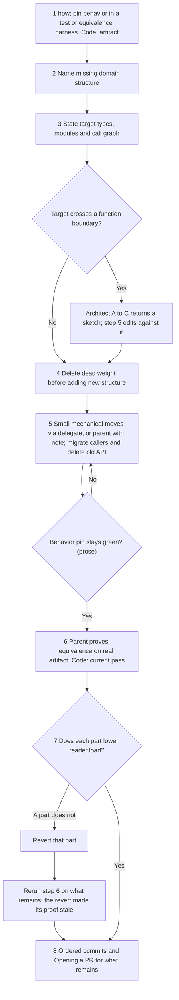

Source: [core/playbooks/refactoring.md:5](../core/playbooks/refactoring.md#L5), [core/playbooks/refactoring.md:7](../core/playbooks/refactoring.md#L7), [core/playbooks/refactoring.md:9](../core/playbooks/refactoring.md#L9), [core/playbooks/refactoring.md:11](../core/playbooks/refactoring.md#L11), [core/playbooks/refactoring.md:13](../core/playbooks/refactoring.md#L13), [core/playbooks/refactoring.md:14](../core/playbooks/refactoring.md#L14), [build/route-contracts.json:18](../build/route-contracts.json#L18).

<a id="diagram-16"></a>

## 16. Prototype: settle an empirical or visual decision

The source deliberately makes this a cheap throwaway instrument. It does not require production architecture or a test suite for the sketch. Observation of the relevant behavior is the check. The record gates step 5 (current observation evidence) and step 6 (the recommendation artifact).

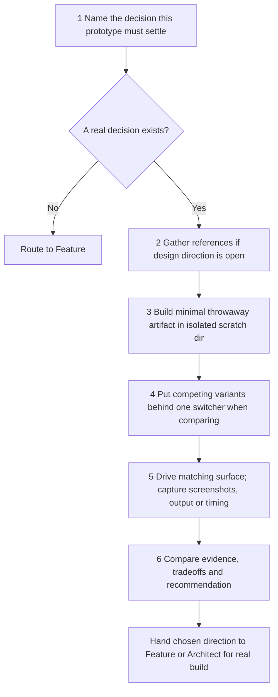

Source: [core/playbooks/prototype.md:7](../core/playbooks/prototype.md#L7), [core/playbooks/prototype.md:11](../core/playbooks/prototype.md#L11), [build/route-contracts.json:17](../build/route-contracts.json#L17).

<a id="diagram-17"></a>

## 17. Perf issue: one measured performance fix

Hypotheses come from actual traces. The strategy families in the playbook are suggestions conditional on a measured signal, not eight mandatory experiments. Architect, when the fix crosses a function boundary, stops after Phase C and step 3 implements its sketch. The record gates the step 1 baseline artifact, step 3 (a returned delegate or a parent note) and step 4 comparison evidence.

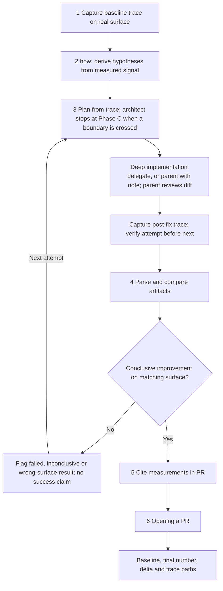

Source: [core/playbooks/perf-issue.md:5](../core/playbooks/perf-issue.md#L5), [core/playbooks/perf-issue.md:16](../core/playbooks/perf-issue.md#L16), [core/playbooks/perf-issue.md:17](../core/playbooks/perf-issue.md#L17), [build/route-contracts.json:16](../build/route-contracts.json#L16).

<a id="diagram-18"></a>

## 18. Hillclimb: repeat controlled experiments on one metric

The stop rule differs from Autonomous run. Hillclimb may stop when remaining ideas are marginal, with an honest unmet-target report; step 7's mandatory verification then fails, so the record stays incomplete. It must not silently lower the target. The normal loop is step 5 repeated; step 6 applies only on a stall. A delegate working in its own worktree records nothing; the parent records its return and re-runs the measurement in the run's workspace. Freezing the harness is an instruction here; the recorder freezes a harness only for the Bug fix baseline. The record gates the step 2 artifact, step 5 (a returned delegate or a parent note) and step 7 verification, and the route is unordered.

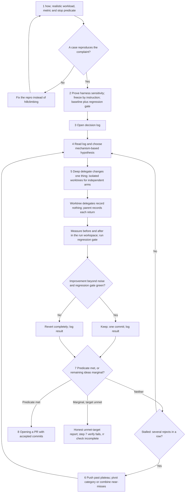

Source: [core/playbooks/hillclimb.md:7](../core/playbooks/hillclimb.md#L7), [core/playbooks/hillclimb.md:8](../core/playbooks/hillclimb.md#L8), [core/playbooks/hillclimb.md:12](../core/playbooks/hillclimb.md#L12), [core/playbooks/hillclimb.md:17](../core/playbooks/hillclimb.md#L17), [core/playbooks/hillclimb.md:18](../core/playbooks/hillclimb.md#L18), [build/route-contracts.json:10](../build/route-contracts.json#L10), [core/skills/poteto-mode/scripts/run-record.py:1036](../core/skills/poteto-mode/scripts/run-record.py#L1036), [core/skills/poteto-mode/scripts/run-record.py:1188](../core/skills/poteto-mode/scripts/run-record.py#L1188).

<a id="diagram-19"></a>

## 19. Runtime forensics: diagnose a live process

This route may instrument the running process to test a mechanism, but its requested deliverable remains a diagnosis. It does not automatically implement a production fix. The record gates the step 1 capture artifact and step 3 mechanism evidence.

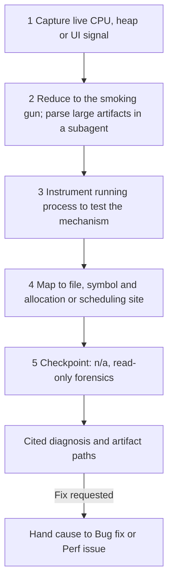

Source: [core/playbooks/runtime-forensics.md:5](../core/playbooks/runtime-forensics.md#L5), [core/playbooks/runtime-forensics.md:6](../core/playbooks/runtime-forensics.md#L6), [core/playbooks/runtime-forensics.md:11](../core/playbooks/runtime-forensics.md#L11), [build/route-contracts.json:19](../build/route-contracts.json#L19).

<a id="diagram-20"></a>

## 20. Trace forensics: diagnose an already-captured artifact

Unlike runtime forensics, this starts from a fixed dataset. Without a corroborating paired capture, the output must preserve the distinction between a supported hypothesis and a confirmed cause. The record gates only the step 6 diagnosis artifact.

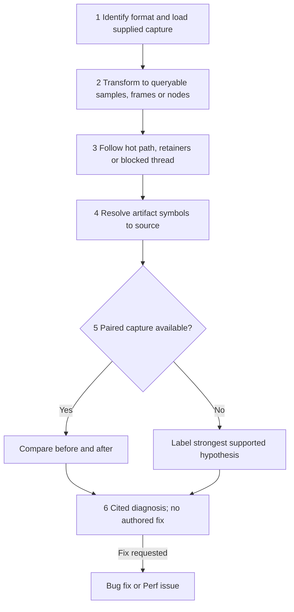

Source: [core/playbooks/trace-forensics.md:7](../core/playbooks/trace-forensics.md#L7), [core/playbooks/trace-forensics.md:11](../core/playbooks/trace-forensics.md#L11), [build/route-contracts.json:22](../build/route-contracts.json#L22).

<a id="diagram-21"></a>

## 21. Visual parity: migrate without changing pixels

The baseline is frozen before migration, by instruction. Shared primitives are a blocking prerequisite, then independent components can use separate worktrees. The playbook defines a nonzero image diff as failure. The record gates the step 1 baseline artifact and step 4 diff evidence.

```mermaid
flowchart TD
    B["1 Capture baseline screenshots across component states"] --> LOCK["2 Freeze harness and baseline; no restructuring to game diff"]
    LOCK -->|Baseline looks wrong| ASKB["Stop and ask; do not edit the baseline"]
    LOCK --> PRIM["3 Migrate shared primitives first"]
    PRIM --> COMP["Migrate one component per owner and worktree"]
    COMP --> IMG["4 Capture matching surface and compute image diff"]
    IMG --> ZERO{"Pixel diff is zero?"}
    ZERO -->|No| FIX["Investigate delta and adjust migrated component"]
    FIX --> IMG
    ZERO -->|Yes| PR["5 Opening a PR per component or safe batch"]
    PR --> MORE{"Components remain?"}
    MORE -->|Yes| COMP
    MORE -->|No| OUT["Per-component results and baseline path"]
```

Source: [core/playbooks/visual-parity.md:5](../core/playbooks/visual-parity.md#L5), [core/playbooks/visual-parity.md:6](../core/playbooks/visual-parity.md#L6), [build/route-contracts.json:23](../build/route-contracts.json#L23).

<a id="diagram-22"></a>

## 22. Authoring a skill: instructions are the artifact

Skill descriptions influence discovery. The body and references are loaded when reached. A structural change gets meaningful cases; a subjective writing change may skip them explicitly. The style rules are the playbook's own closing paragraph plus unslop, which covers every prose surface. The record gates step 2 validation.

```mermaid
flowchart TD
    REQ["Write or change a SKILL.md"] --> WRITE["1 Name, trigger description, imperative body, linked references"]
    WRITE --> STYLE["Playbook style rules: delete prose that changes no decision; delegate by path; unslop"]
    STYLE --> VALID["2 Validate frontmatter, referenced files and cross-skill links"]
    VALID --> STRUCT{"3 Structural behavior change?"}
    STRUCT -->|Yes| CASES["Exercise relevant cases"]
    STRUCT -->|No| SKIP["Explicit subjective-test skip"]
    CASES --> PR["4 Opening a PR"]
    SKIP --> PR
```

Source: [core/playbooks/authoring-a-skill.md:5](../core/playbooks/authoring-a-skill.md#L5), [core/playbooks/authoring-a-skill.md:14](../core/playbooks/authoring-a-skill.md#L14), [core/skills/poteto-mode/SKILL.md:62](../core/skills/poteto-mode/SKILL.md#L62), [build/route-contracts.json:2](../build/route-contracts.json#L2).

<a id="diagram-23"></a>

## 23. Eval: compare workflow or prompt variants

Candidates receive ordinary task prompts in sanitized environments. The rubric belongs to the judge. The blinded judge runs at step 5, then step 6 checks chain-following from actual file reads, not a candidate saying it followed PSTACK. On a host with no delegation, step 4 runs the candidates inline one at a time, each in its own directory and blind to the others, and step 5 judges inline once every candidate is written, saying the judge shared the candidates' model. The route is ordered, and the record gates steps 4 and 5 (a returned delegate, or a parent note naming the limitation), step 6 and step 7.

```mermaid
flowchart TD
    F["1 Define variant, success and private judging rubric"] --> ENV["2 Prepare isolated sanitized candidate environments"]
    ENV --> PROMPT["3 Write one organic user prompt"]
    PROMPT --> TIER{"Delegation available?"}
    TIER -->|Yes| RUN["4 Run candidates in parallel with available model diversity"]
    TIER -->|No, Tier 0| INL["4 Candidates inline one at a time, own dir, blind; note 'parent: limitation'"]
    RUN --> J["5 One blinded judge on a different family sees labeled outputs and rubric"]
    INL --> JI["5 Judge inline after every candidate is written; say it shared their model; parent note"]
    JI --> TRACE
    J --> TRACE["6 Read in-scope transcripts: files each candidate actually opened"]
    TRACE --> READ["7 Parent reads every output and compares with the judge"]
    READ --> OUT["Evidence, disagreements and promotion recommendation"]
```

Source: [core/playbooks/eval.md:17](../core/playbooks/eval.md#L17), [core/playbooks/eval.md:20](../core/playbooks/eval.md#L20), [core/playbooks/eval.md:21](../core/playbooks/eval.md#L21), [core/playbooks/eval.md:22](../core/playbooks/eval.md#L22), [build/route-contracts.json:8](../build/route-contracts.json#L8).

<a id="diagram-24"></a>

## 24. Babysit: PR status, review comments, or merge-readiness

The declared mode decides which steps run. Opening a PR does not invoke this route. check makes one status read and never starts the polling loop. threads-only runs steps 2 to 4, 8 and 9 on the named threads, batches its fixes into one push wave, and skips conflicts, CI and the watcher. Step 9 binds every mode, and after a merge-ready stop it sweeps the run's triage decisions once, offering team-useful dismissal patterns to the shared rubric. A fix whose owning PR already merged becomes a new PR on top of the stack. Babysit never authorizes merging; only an explicit request routed to Shipping does. The record needs the step 1 artifact and a step 6 artifact: in check mode the single status read is that artifact, and only a skip whose reason starts with threads-only is accepted there. The route is unordered.

```mermaid
flowchart TD
    ASK["PR-status or review request"] --> MODE{"1 Declare mode and resolve forge before any poll"}
    MODE -->|Check status; small or docs-only PR| CHECK["check: one status read; watch-pr --status-only or origin pr view"]
    CHECK --> COUT["Status read is the step 6 artifact, note check; report what steps 5, 7 and 8 would take on"]
    COUT --> HUMAN
    MODE -->|Address review comments| THREADS["threads-only: steps 2 to 4 on the named threads; step 6 skip starts with threads-only"]
    THREADS --> TTRI["8 Triage skeptically; batch fixes into one push wave"]
    TTRI --> HUMAN["9 Stop at the human line; no merge"]
    MODE -->|Plan still executing| BG["background: triage without blocking build"]
    MODE -->|Get green or babysit| DRIVE["drive: loop to merge-ready"]
    BG --> FRONT["2 Lowest unmerged PR; 3 one babysitter per stack"]
    DRIVE --> FRONT
    FRONT --> CONFLICT{"Conflict or stale base?"}
    CONFLICT -->|Yes| OWNER["Report required owner rebase; no topology edits"]
    CONFLICT -->|No| REVIEW["Triage comments skeptically; batch real fixes"]
    REVIEW --> CI["7 Classify CI; one fresh build for genuine flake"]
    CI --> WATCH["6 Selected forge's watcher drives rechecks under /loop"]
    WATCH --> READY{"Forge says merge-ready?"}
    READY -->|No, actionable work| FRONT
    READY -->|Yes| STOP["Report frontier ready and stop; do not merge"]
    STOP --> SWEEP["9 Sweep triage decisions once; offer team-useful dismissal patterns to the shared rubric in their own PR"]
    MERGED4["4 Owning PR already merged: the fix becomes a new PR on top of the stack"] -.-> REVIEW
    STOP -->|User explicitly requests landing| SHIP["Route to Shipping"]
```

Source: [core/playbooks/babysit.md:7](../core/playbooks/babysit.md#L7), [core/playbooks/babysit.md:10](../core/playbooks/babysit.md#L10), [core/playbooks/babysit.md:12](../core/playbooks/babysit.md#L12), [core/playbooks/babysit.md:18](../core/playbooks/babysit.md#L18), [core/playbooks/babysit.md:23](../core/playbooks/babysit.md#L23), [build/route-contracts.json:6](../build/route-contracts.json#L6).

<a id="diagram-25"></a>

## 25. Shipping: independently verify and land from the bottom

This route requires an explicit landing request. Independent verdicts pin a patch, not merely a green CI status. A changed patch needs a new verdict; an unchanged patch after rebase still needs current mergeability and CI checks. Patch-id pinning is an instruction. The recorder's freshness test compares the content fingerprint of the local workspace, not forge patch-ids. If merging deploys the repository, every merge stops for a human. The record gates step 1 (one returned delegate recorded with --phase step-1, though the prose asks for one verifier per PR, plus current evidence), step 3 and step 9, and the route is unordered.

```mermaid
flowchart TD
    A["Explicit ship or land request; resolve forge and deployment boundary"] --> V["1 Independent verifier per PR exercises parent versus head"]
    V --> CEIL["2 Find contiguous passing run from lowest unmerged PR"]
    CEIL --> PATCH["3 Compare recorded patch-id with current base-to-head diff"]
    PATCH --> CHANGED{"Patch changed?"}
    CHANGED -->|Yes| V
    CHANGED -->|No| BOTTOM["4 Prepare only bottom PR on current trunk; retarget it"]
    BOTTOM --> RECHECK["Recheck patch verdict, CI and mergeability after push"]
    RECHECK -->|Patch changed| V
    RECHECK --> DEP{"Operator said merging deploys?"}
    DEP -->|Yes| HUMAN["Every merge stops for a human"]
    HUMAN --> LAND
    DEP -->|No| LAND["5 Squash merge, or arm only bottom if merge-when-ready requested"]
    LAND --> WATCH["6 and 8 Confirm forge state; watch actual merge or failure"]
    WATCH --> MERGED{"Actually merged?"}
    WATCH -->|Source-defined hard failure| FAIL["Report failed frontier; diagnose before queue mutation"]
    MERGED -->|No| WATCH
    MERGED -->|Yes| NEXT["7 Fetch trunk, confirm merge and inspect new bottom"]
    NEXT --> MORE{"Inside verified ceiling?"}
    MORE -->|Yes| PATCH
    MORE -->|No| OUT["9 Stop at ceiling; report landed work and next gap"]
```

Source: [core/playbooks/shipping.md:7](../core/playbooks/shipping.md#L7), [core/playbooks/shipping.md:9](../core/playbooks/shipping.md#L9), [core/playbooks/shipping.md:14](../core/playbooks/shipping.md#L14), [core/playbooks/shipping.md:10](../core/playbooks/shipping.md#L10), [core/playbooks/shipping.md:18](../core/playbooks/shipping.md#L18), [build/route-contracts.json:21](../build/route-contracts.json#L21), [core/skills/poteto-mode/scripts/run-record.py:148](../core/skills/poteto-mode/scripts/run-record.py#L148), [core/skills/poteto-mode/scripts/run-record.py:234](../core/skills/poteto-mode/scripts/run-record.py#L234), [core/skills/poteto-mode/scripts/run-record.py:1040](../core/skills/poteto-mode/scripts/run-record.py#L1040).

<a id="diagram-26"></a>

## 26. Autonomous run: one task until a predicate holds

This playbook uses a host wake mechanism such as /loop. PSTACK does not implement that host command. A useful workflow document cannot keep a stopped host session alive by itself. The record gates the step 1 predicate artifact and step 6 verification.

```mermaid
flowchart TD
    P["1 State checkable exit predicate"] --> WAKE["2 Select event watcher plus heartbeat, or timed heartbeat"]
    WAKE --> ITER["3 Smallest evidence-backed change"]
    ITER --> VERIFY["Verify against predicate before next unit"]
    VERIFY --> ADV{"Did it advance the task?"}
    ADV -->|Yes| KEEP["Commit useful change"]
    ADV -->|No| REVERT["Discard unsupported change"]
    KEEP --> LOG["5 Log iteration through show-me-your-work"]
    REVERT --> LOG
    LOG --> DONE{"6 Predicate met?"}
    DONE -->|No| NEXT["4 Resolve blocking discoveries; separate side-fix PRs"]
    NEXT --> ITER
    DONE -->|Yes| OUT["Report predicate, iterations, kept and discarded work"]
    NEXT -->|Actual dead end| BLOCK["Report incomplete with evidence and resume point"]
```

Source: [core/playbooks/autonomous-run.md:5](../core/playbooks/autonomous-run.md#L5), [core/playbooks/autonomous-run.md:6](../core/playbooks/autonomous-run.md#L6), [build/route-contracts.json:3](../build/route-contracts.json#L3).

<a id="diagram-27"></a>

## 27. figure-it-out: design a bespoke workflow

This is a skill, not one of the 23 bundled playbook files. When reached through the router, the run is started before the work with rr init --route figure-it-out --phases, the router's rule for every run; the phase names come from Phase B. The skill itself never mentions rr, so how init is ordered against Phase B is inference. Every bespoke phase is mandatory: each needs an artifact, a phase named verify needs current passing verification, and a phase named review needs a current review. --phases cannot replace a built-in playbook. Architect, when used for a one-way-door decision, stops after Phase C and the Phase C loop implements its sketch. It should not attach full Orchestrate machinery to every ambitious task.

```mermaid
flowchart TD
    START["Large bespoke effort or no fitting playbook"] --> PRINC["Read poteto-mode principles index"]
    PRINC --> A["A Frame: falsifiable done predicate, quantified scope and rigor"]
    A --> B["B Design atomic units; riskiest unknown first"]
    B --> HAR["Build verification harness and pre-change baseline"]
    HAR --> DESIGN["Architect for one-way doors, stopping at its Phase C; decompose safe parallel seams"]
    DESIGN --> LIST["Write bespoke phase list; its names feed rr init --phases (order inferred)"]
    LIST --> LOOP["C Each unit: hypothesis, smallest change and measurement"]
    LOOP --> DEC{"Advances predicate?"}
    DEC -->|Yes| KEEP["Keep verified unit"]
    DEC -->|No| REV["Revert and revise hypothesis or gate"]
    KEEP --> LOG["D Log decision and evidence as work happens"]
    REV --> LOG
    LOG --> MORE{"More units needed?"}
    MORE -->|Yes| LOOP
    MORE -->|No| E["E Verify whole real product against original predicate"]
    E --> OUT["Workflow, rigor, trail, verified result and remaining gaps"]
    GATES["Record: every bespoke phase mandatory with artifact; verify and review phases need current evidence"] -.-> LIST
```

Source: [core/skills/figure-it-out/SKILL.md:12](../core/skills/figure-it-out/SKILL.md#L12), [core/skills/figure-it-out/SKILL.md:29](../core/skills/figure-it-out/SKILL.md#L29), [core/skills/architect/SKILL.md:22](../core/skills/architect/SKILL.md#L22), [core/skills/poteto-mode/SKILL.md:188](../core/skills/poteto-mode/SKILL.md#L188), [core/skills/poteto-mode/SKILL.md:192](../core/skills/poteto-mode/SKILL.md#L192), [core/skills/poteto-mode/scripts/run-record.py:626](../core/skills/poteto-mode/scripts/run-record.py#L626), [core/skills/poteto-mode/scripts/run-record.py:657](../core/skills/poteto-mode/scripts/run-record.py#L657).

<a id="diagram-28"></a>

## 28. Multi-phase plan: produce the plan and stop

This playbook does not authorize implementation. It creates a plan naming its future execution playbook. The required skeleton includes per-PR unit, live and performance evidence, with ten live lanes. That ceremony belongs to this planning route, not to every bug fix. check-plan.mjs reads the skeleton's own placeholders from the playbook and reports any left unfilled. The record gates the step 1 artifact. Step 4 takes a skip only when its reason starts with small-change, and steps 6 and 7 take one only after step 4 was skipped, so the small-change exit is enforced by the reason token; the record refuses any other step-4 skip.

```mermaid
flowchart TD
    REQ["Request multi-phase or multi-PR plan"] --> SMALL{"1 One or two obvious files?"}
    SMALL -->|Yes| SKIP["Say plan is unnecessary; step 1 artifact; skip 2 to 7; step 4 reason starts small-change"]
    SMALL -->|No| PROTO["2 Settle observable forks with prototypes"]
    PROTO --> EXP["3 Explorers return source pointers and verification commands"]
    EXP --> DOC["4 Fill complete plan skeleton; name dependency graph and execution playbook"]
    DOC --> EVID["Per PR: unit, ten live lanes, perf, review gate and merge rule"]
    EVID --> WRITE["5 Technical-writing and unslop"]
    WRITE --> CHECK["6 node skill-dir/scripts/check-plan.mjs plan.md: structure, lanes, style, unfilled placeholders"]
    CHECK --> OK{"No reported violations?"}
    OK -->|No| DOC
    OK -->|Yes| STOP["7 Return plan path and checker output; stop"]
    STOP -->|Operator explicitly says go| EXEC["Execute under named autopilot or orchestrate playbook"]
```

Source: [core/playbooks/multi-phase-plan.md:5](../core/playbooks/multi-phase-plan.md#L5), [core/playbooks/multi-phase-plan.md:8](../core/playbooks/multi-phase-plan.md#L8), [core/playbooks/multi-phase-plan.md:10](../core/playbooks/multi-phase-plan.md#L10), [core/playbooks/multi-phase-plan.md:11](../core/playbooks/multi-phase-plan.md#L11), [core/skills/poteto-mode/scripts/check-plan.mjs:44](../core/skills/poteto-mode/scripts/check-plan.mjs#L44), [core/skills/poteto-mode/scripts/check-plan.mjs:137](../core/skills/poteto-mode/scripts/check-plan.mjs#L137), [build/route-contracts.json:12](../build/route-contracts.json#L12), [core/skills/poteto-mode/scripts/run-record.py:761](../core/skills/poteto-mode/scripts/run-record.py#L761).

<a id="diagram-29"></a>

## 29. Orchestrate: a standing program with a queue and ledger

orch is real state code: init, units, ledger, inbox, gates, standing orders, status and a store lock. It never spawns, waits or wakes; the coordinator does that through host mechanisms. Delegation depth stays at one. A program too large for one coordinator adds track coordinators as peer standing sessions, not nested delegates. Graphite is optional: orch frontier set --git --root walks the base-branch chain through gh, the gt mode remains for stacks gt tracks, and a forge without gh gets a hand-written frontier.json. A failed unit gets two attempts in total. When one agent could finish inside the budget, step 1 closes this record into an Autonomous run record with rr reroute, which works only while the run is in its first phase, not paused, with step 1 neither failed nor blocked, no open or failed delegate and no actionable finding, and only to a target the contract names. The record gates the step 3 artifact, a returned delegate at step 4 and fresh verification at step 7; the route is unordered.

```mermaid
flowchart TD
    FRAME["1 Quantify program, predicate and time budget"] --> ONE{"One agent can finish within session budget?"}
    ONE -->|Yes| RR["Record step 1 done; rr reroute --route autonomous-run"]
    RR --> AUTO["Continue as Autonomous run, no program machinery"]
    ONE -->|No| INIT["2 orch init; standing orders, trail and frontier.json"]
    INIT --> PILOT["3 Pilot one unit through brief, work, proof, ledger and landing"]
    PILOT --> FIX["Fix brief or verification contract from pilot evidence"]
    FIX --> WAVE["4 Rolling window of leaf workers; workers spawn nothing"]
    TRACK["Past one-drain threshold: peer track-coordinator sessions"] -.-> WAVE
    WAVE --> EVENT["Completion becomes orch inbox push pointer"]
    EVENT --> DRAIN["5 orch inbox drain; classify; orch unit and ledger record; orch status"]
    RETRY["Failed unit: one retry by failure mode, then dropped"] -.-> DRAIN
    DRAIN --> VERIFY["Verification unit where needed; cheap proof can be inline"]
    VERIFY --> LAND["6 Continuously land verified units; recompute frontier"]
    FRONT["Frontier: orch frontier set --git --root via gh; gt mode optional; by hand without gh"] -.-> LAND
    LAND --> MORE{"Predicate and budget allow more work?"}
    MORE -->|Yes| WAVE
    MORE -->|No| CLOSE["7 Reconcile all children, verify goal and audit trail"]
    CLOSE --> OUT["Counts, frontier, verdicts, abandoned work, gates and store"]
```

Source: [core/playbooks/orchestrate.md:15](../core/playbooks/orchestrate.md#L15), [core/playbooks/orchestrate.md:16](../core/playbooks/orchestrate.md#L16), [core/playbooks/orchestrate.md:19](../core/playbooks/orchestrate.md#L19), [core/playbooks/orchestrate.md:60](../core/playbooks/orchestrate.md#L60), [core/playbooks/orchestrate.md:79](../core/playbooks/orchestrate.md#L79), [core/playbooks/orchestrate.md:97](../core/playbooks/orchestrate.md#L97), [core/skills/poteto-mode/scripts/orch/orch.ts:282](../core/skills/poteto-mode/scripts/orch/orch.ts#L282), [core/skills/poteto-mode/scripts/orch/orch.ts:486](../core/skills/poteto-mode/scripts/orch/orch.ts#L486), [build/route-contracts.json:14](../build/route-contracts.json#L14), [core/skills/poteto-mode/references/session-tracking.md:64](../core/skills/poteto-mode/references/session-tracking.md#L64), [core/skills/poteto-mode/scripts/run-record.py:924](../core/skills/poteto-mode/scripts/run-record.py#L924), [core/skills/poteto-mode/scripts/run-record.py:940](../core/skills/poteto-mode/scripts/run-record.py#L940).

<a id="diagram-30"></a>

## 30. Autopilot-full: independent owners build and merge

Each PR owner owns its full lifecycle; the root supplies independent verification, audits and countersigns. The playbook explicitly opens ready PRs before self-proof to create an early trail, unlike the ordinary Bug fix sequence. A request to state the protocol is not execution authorization. The merge authorization is the operator's full-autonomy grant plus the root's clean verdict. A countersign covers only a genuinely new raise of a pinned gate or budget value; it is never a merge approval. The record gates step 2 (returned owner delegates) and step 4 (current verification evidence), and the route is unordered.

```mermaid
flowchart TD
    GO["1 Operator gives execution go; mark operator-owned items; arm goal"] --> OWN["2 One owner per PR; resolve forge"]
    OWN --> PAR["3 Independent branches and owners run in parallel"]
    PAR --> EARLY["Owner starts trail, first push and ready PR early"]
    EARLY --> BUILD["Owner proves behavior, triages review, cleans, rebases and babysits"]
    BUILD --> SHA["Owner reports merge-ready at trunk-current head SHA"]
    SHA --> ROOT["4 Root swarm: gates, live behavior, receipts, diff and trunk regression lane"]
    ROOT --> PASS{"Clean verdict at current patch?"}
    PASS -->|No| BUILD
    PASS -->|Yes| HUMAN{"Operator-owned item, or merging deploys?"}
    HUMAN -->|Yes| HOLD["Stop at merge-ready; wait for operator"]
    HUMAN -->|No| MERGE["5 Owner squash-merges: autonomy grant plus clean verdict"]
    MERGE --> PAR
    AUDIT["6 Root tick audits liveness and trails; countersigns only a new pinned-value raise"] -.-> PAR
    STOP["7 Operator stop"] --> ZERO["Immediate zero-writes hold for all owners"]
```

Source: [core/playbooks/autopilot-full.md:5](../core/playbooks/autopilot-full.md#L5), [core/playbooks/autopilot-full.md:9](../core/playbooks/autopilot-full.md#L9), [core/playbooks/autopilot-full.md:10](../core/playbooks/autopilot-full.md#L10), [core/playbooks/autopilot-full.md:14](../core/playbooks/autopilot-full.md#L14), [build/route-contracts.json:4](../build/route-contracts.json#L4).

<a id="diagram-31"></a>

## 31. Autopilot-stack: build and verify, then operator lands

Owners build, while the root alone writes stack topology. A clean verdict appends to the stack; nothing lands. The playbook grants no merge, auto-merge or merge-when-ready to anyone but the operator. The record gates step 1 (returned owner delegates), step 4 (current verification evidence) and the step 8 chain artifact, and the route is unordered.

```mermaid
flowchart TD
    GO["Explicit execution go; arm goal and operator gates"] --> OWN["1 Owners build, open early ready PRs, prove and babysit"]
    OWN --> READY["4 Owner reports STACK-READY with exact SHA"]
    READY --> SW["Root swarm verifies gates, live behavior and receipts"]
    SW --> PASS{"Clean verdict?"}
    PASS -->|No| OWN
    PASS -->|Yes| APPEND["5 Root appends in verified or requested order; no owner merges"]
    APPEND --> TOPO["6 Root rebases child onto exact parent and sets PR base"]
    TOPO --> DRIFT["7 Absorb trunk drift bottom-up; compare stable patch-id"]
    DRIFT --> CHANGED{"Patch changed?"}
    CHANGED -->|Yes| SW
    CHANGED -->|No| CHECK["Refresh CI and mergeability"]
    CHECK --> OUT["8 Deliver one verified linear chain"]
    OUT --> HUMAN["Operator reviews and lands; no merge, auto-merge or merge-when-ready by agents"]
    TICK["2 Root audit wake tick and liveness checks"] -.-> OWN
    HOLD["3 Operator stop"] --> ZERO["All owners hold without writes"]
```

Source: [core/playbooks/autopilot-stack.md:9](../core/playbooks/autopilot-stack.md#L9), [core/playbooks/autopilot-stack.md:10](../core/playbooks/autopilot-stack.md#L10), [core/playbooks/autopilot-stack.md:17](../core/playbooks/autopilot-stack.md#L17), [build/route-contracts.json:5](../build/route-contracts.json#L5).

<a id="diagram-32"></a>

## 32. Worktree cleanup: disk reclamation with usage checks

This is not a code-change-to-PR flow. The audit helper suggests buckets; the agent must still check actual usage. The helper runs on GNU and BSD tools. A worktree with tracked edits buckets as hold-wip even when it also has untracked files; untracked-only work is hold-untracked. The port requires an explicit decision before discarding either. Steps 2 to 4 are instructions: the record gates only the step 1 audit artifact and the step 5 prune report, which is skippable. The helper searches the Claude, Cursor, Codex, Copilot CLI and VS Code transcript stores, or the list in PSTACK_TRANSCRIPTS; a store that is absent only blanks the last-chat column.

```mermaid
flowchart TD
    SNAP["1 df -h and worktree-audit.sh from git worktree list. Code: artifact"] --> BUCKET["Buckets: hold-wip, hold-untracked, hold-open-pr, verify-recent-chat, safe, review"]
    BUCKET --> PIN["2 Cross-check pinned and active chats from user or sidebar"]
    PIN --> RECENT["3 Subagents read transcripts for recent or doubtful rows"]
    COP["Last-chat search: Claude, Cursor, Codex, Copilot CLI, VS Code stores"] -.-> RECENT
    RECENT --> USE{"In use?"}
    USE -->|Yes| KEEP["Keep and report why"]
    USE -->|No| DIRTY{"4 Tracked edits, untracked files, or both?"}
    DIRTY -->|Yes| DECIDE["Show diff and untracked list; explicit decision for each"]
    DIRTY -->|No, clean and confirmed safe| REMOVE["5 Remove confirmed worktrees; prune; df -h and re-list"]
    DECIDE -->|Authorized removal| REMOVE
    DECIDE -->|Keep| KEEP
    REMOVE --> SIM["6 Clear eligible simulators or caches within scope"]
    SIM --> OUT["Report space reclaimed, pruned worktrees and exclusions"]
```

Source: [core/playbooks/worktree-cleanup.md:5](../core/playbooks/worktree-cleanup.md#L5), [core/playbooks/worktree-cleanup.md:8](../core/playbooks/worktree-cleanup.md#L8), [core/playbooks/worktree-cleanup.md:9](../core/playbooks/worktree-cleanup.md#L9), [core/skills/poteto-mode/scripts/worktree-audit.sh:41](../core/skills/poteto-mode/scripts/worktree-audit.sh#L41), [core/skills/poteto-mode/scripts/worktree-audit.sh:61](../core/skills/poteto-mode/scripts/worktree-audit.sh#L61), [core/skills/poteto-mode/scripts/worktree-audit.sh:115](../core/skills/poteto-mode/scripts/worktree-audit.sh#L115), [build/route-contracts.json:24](../build/route-contracts.json#L24).

<a id="diagram-33"></a>

## 33. Opening a PR: the shared shipping-preparation subroutine

Callers must arrange the worktree before editing, and start or move the run record into it before any evidence; reaching this playbook at the end is too late to establish that prerequisite. A delegate in its own worktree records nothing; the parent records its return and re-verifies in the run's workspace. PR creation, babysitting, and merging are separate paths. It also runs for each PR that Autonomous run, Orchestrate and the Autopilots open. The router and this playbook both list the routes that end without one: Investigation, Runtime forensics, Trace forensics, Prototype, Eval, Multi-phase plan, Pause safely, Session pickup and Worktree cleanup; Babysit and Shipping work on PRs that already exist. Its phases run cleanup before commits, matching the prose. The record requires current verification at reverify even when nothing changed, and the create artifact. /deslop is not bundled, so the code-slop pass runs in plain words when the skill is absent.

```mermaid
flowchart TD
    WORK["worktree: worktree off main; run record started or moved there"] --> DONE["Caller finishes implementation and proof"]
    DONE --> CLEAN["cleanup: code-slop pass and no-comments"]
    DELW["Delegate in its own worktree records nothing; parent records its return"] -.-> DONE
    CLEAN --> K["commits: small ordered commits"]
    K --> CHANGE{"reverify: code or harness changed after proof?"}
    CHANGE -->|Yes| V["Rerun caller's verification on final tree"]
    CHANGE -->|No| ATT["Attach the passing output that still describes this tree"]
    V --> WRITE["write: technical-writing then unslop for title, body and commits"]
    ATT --> WRITE
    WRITE --> FORGE["Choose gh, or Origin if installed and repository resolves"]
    FORGE --> CHECK["Caller rr check through the step before this one"]
    CHECK -->|Reported problems| FIX["Resolve before creating PR"]
    FIX --> DONE
    CHECK -->|No reported problem| CREATE["create: ready PR; child targets parent branch when stacked"]
    CREATE --> VIEW["readiness: read actual PR state; make ready if needed"]
    VIEW --> OUT["Return URL to caller; no automatic babysit or merge"]
```

Source: [core/playbooks/opening-a-pr.md:3](../core/playbooks/opening-a-pr.md#L3), [core/playbooks/opening-a-pr.md:5](../core/playbooks/opening-a-pr.md#L5), [core/playbooks/opening-a-pr.md:9](../core/playbooks/opening-a-pr.md#L9), [core/playbooks/opening-a-pr.md:25](../core/playbooks/opening-a-pr.md#L25), [core/playbooks/opening-a-pr.md:33](../core/playbooks/opening-a-pr.md#L33), [build/gen-routes.py:67](../build/gen-routes.py#L67), [build/route-contracts.json:13](../build/route-contracts.json#L13), [core/skills/poteto-mode/references/session-tracking.md:49](../core/skills/poteto-mode/references/session-tracking.md#L49).

<a id="diagram-34"></a>

## 34. Run records, completion checks, and the live observer

The agent explicitly selects the route and records events. A record lives in the repository's main checkout, so removing a worktree never removes it. A plain submodule keeps its own. When the main checkout cannot be written or is gone, init records in the worktree and prints a note. --run finds a record in the session checkout, then the record home, then live worktrees of this repository, and a run id is unique across them. The run fingerprints its workspace, the checkout where init ran or the worktree workspace --path moved it to, and record commands refuse any other checkout. A delegate working in its own worktree records nothing. Only gated phases are mandatory. Freshness is content-based; commit-shaped trees are compared only by the Bug fix baseline, ground check, and older entries without a content id. The checker does not execute stored commands. A command that fails with exit 2 withholds its standard output and reports on standard error. Pause safely starts no run: init refuses it.

```mermaid
flowchart TD
    TXT["Playbook Markdown"] --> GEN["Build: gen-routes.py extracts phases, checklist and graph"]
    BP["workflow-blueprints.json: Bug fix flow drawing"] --> GEN
    CONTRACT["route-contracts.json: gates, ordered, reroute_to, run: false"] --> GEN
    GEN --> ROUTES["routes.json: phases, checklists and contracts; no request classifier"]
    AG["Parent chooses route"] --> INIT{"rr init --route"}
    ROUTES --> INIT
    INIT -->|pause-safely| NORUN["Refused: records on the task's run"]
    INIT -->|Main checkout writable| HOME["Record in the main checkout; plain submodule keeps its own"]
    INIT -->|Main checkout unwritable or gone| LOCAL["Record in this worktree; note printed"]
    HOME --> REC[".pstack/runs/run-id.json; id unique across record dirs"]
    LOCAL --> REC
    REC --> WS["Workspace: where init ran; workspace --path moves it before evidence, not with a delegate open, once"]
    FIND["--run searches session checkout, record home, live worktrees"] -.-> REC
    REC --> TASKS["rr tasks --json: checklist, phase ids, state and requirements"]
    AG --> EVENTS["rr phase, evidence, delegate, finding, ground, pause, reroute from the workspace only"]
    DELW["Delegate in its own worktree records nothing; parent records its return"] -.-> EVENTS
    FILE["Outputs under .pstack or outside the workspace"] --> EVENTS
    EVENTS --> REC
    REROUTE["reroute: declared pairs only; refused with open finding or open or failed delegate; no orphan on failure"] -.-> EVENTS
    REC --> CHECK["rr check, optionally --through a phase"]
    CHECK --> GONE{"Workspace still exists?"}
    GONE -->|No| INC["Incomplete, exit 1: evidence cannot be re-fingerprinted"]
    GONE -->|Yes| FP["Fingerprint: content-based; ignored files out; nested repos by working copy; live nested worktrees out; index bits cleared"]
    FP --> C1["Every required phase done or skipped; skip_with and skip_reasons"]
    C1 --> C2["Gates: pass evidence in this attempt; fresh by content; returned delegate or parent note; child steps"]
    C2 --> C3["Order: 15 ordered routes; 5 named pairs on Bug fix; none on 6 others; redoing a phase does not reopen later ones"]
    C3 --> C4["Bug fix only: baseline commit tree, failing repro on it, frozen harness"]
    C4 --> C5["Open or failed delegates, open blocker or act findings, pause, reroute target"]
    C5 --> RESULT["complete, or incomplete with problems"]
    ERR["Exit 2: usage or environment error on stderr; stdout withheld"] -.-> CHECK
    HS["Host session stores"] --> UI["pstack serve: record_dirs per session checkout; check where the record lives"]
    REC --> UI
    UI --> LINK["Link by session id, init output, or time when the workspace is the session checkout"]
    LINK --> LIMIT["No recorded phases means unknown; file reads do not prove completion"]
```

Source: [build/gen-routes.py:138](../build/gen-routes.py#L138), [build/gen-routes.py:186](../build/gen-routes.py#L186), [build/route-contracts.json:15](../build/route-contracts.json#L15), [core/skills/poteto-mode/scripts/run-record.py:81](../core/skills/poteto-mode/scripts/run-record.py#L81), [core/skills/poteto-mode/scripts/run-record.py:148](../core/skills/poteto-mode/scripts/run-record.py#L148), [core/skills/poteto-mode/scripts/run-record.py:274](../core/skills/poteto-mode/scripts/run-record.py#L274), [core/skills/poteto-mode/scripts/run-record.py:413](../core/skills/poteto-mode/scripts/run-record.py#L413), [core/skills/poteto-mode/scripts/run-record.py:427](../core/skills/poteto-mode/scripts/run-record.py#L427), [core/skills/poteto-mode/scripts/run-record.py:452](../core/skills/poteto-mode/scripts/run-record.py#L452), [core/skills/poteto-mode/scripts/run-record.py:499](../core/skills/poteto-mode/scripts/run-record.py#L499), [core/skills/poteto-mode/scripts/run-record.py:526](../core/skills/poteto-mode/scripts/run-record.py#L526), [core/skills/poteto-mode/scripts/run-record.py:653](../core/skills/poteto-mode/scripts/run-record.py#L653), [core/skills/poteto-mode/scripts/run-record.py:681](../core/skills/poteto-mode/scripts/run-record.py#L681), [core/skills/poteto-mode/scripts/run-record.py:871](../core/skills/poteto-mode/scripts/run-record.py#L871), [core/skills/poteto-mode/scripts/run-record.py:916](../core/skills/poteto-mode/scripts/run-record.py#L916), [core/skills/poteto-mode/scripts/run-record.py:966](../core/skills/poteto-mode/scripts/run-record.py#L966), [core/skills/poteto-mode/scripts/run-record.py:1008](../core/skills/poteto-mode/scripts/run-record.py#L1008), [core/skills/poteto-mode/scripts/run-record.py:1116](../core/skills/poteto-mode/scripts/run-record.py#L1116), [core/skills/poteto-mode/scripts/run-record.py:1171](../core/skills/poteto-mode/scripts/run-record.py#L1171), [core/skills/poteto-mode/scripts/run-record.py:1419](../core/skills/poteto-mode/scripts/run-record.py#L1419), [core/skills/poteto-mode/scripts/run-record.py:1453](../core/skills/poteto-mode/scripts/run-record.py#L1453), [core/skills/poteto-mode/scripts/run-record.py:1480](../core/skills/poteto-mode/scripts/run-record.py#L1480), [core/skills/poteto-mode/references/session-tracking.md:52](../core/skills/poteto-mode/references/session-tracking.md#L52), [core/skills/poteto-mode/references/session-tracking.md:56](../core/skills/poteto-mode/references/session-tracking.md#L56), [core/skills/poteto-mode/references/session-tracking.md:66](../core/skills/poteto-mode/references/session-tracking.md#L66), [packaging/src/pstack_cli/observe/runs.py:54](../packaging/src/pstack_cli/observe/runs.py#L54), [packaging/src/pstack_cli/observe/server.py:166](../packaging/src/pstack_cli/observe/server.py#L166), [packaging/src/pstack_cli/observe/CONTRACT.md:124](../packaging/src/pstack_cli/observe/CONTRACT.md#L124), [packaging/src/pstack_cli/observe/CONTRACT.md:127](../packaging/src/pstack_cli/observe/CONTRACT.md#L127), [core/skills/poteto-mode/references/session-tracking.md:70](../core/skills/poteto-mode/references/session-tracking.md#L70).

<a id="diagram-35"></a>

## 35. Benny setup: optional automation has its own entry path

A project install ships the dormant pack; a user-level init skips automations/. Setup enables nothing until the user explicitly asks. It copies the pack, installs pstack into the target with install.sh --target, and checks from a fresh agent that the shared skills resolve in project scope. Cursor uses its automate skill and Automations editor for new automations and an editor checklist for existing ones. Other hosts use a CI or cron runner, the Copilot coding agent through issue assignment, or manual runs. A control adapter missing any capability keeps repro disabled.

```mermaid
flowchart TD
    PACK["Project install ships dormant Benny pack; user-level init skips it"] --> SETUP["Agent reads FOR_AGENTS.md, then setup-benny"]
    SETUP --> COPY["1 Merge pack into .pstack/automations/benny/"]
    COPY --> INST["install.sh --target repo; fresh agent checks shared skills resolve"]
    INST -->|Dependency does not resolve| STOPI["Stop and explain"]
    INST --> CFG["2 and 3 User-owned config, feature map and routing outside the pack"]
    CFG --> CAPS["4 Integration capabilities; 5 optional routing map"]
    CAPS --> CONTROL{"6 Control adapter has every capability?"}
    CONTROL -->|No| REPRODIS["Repro automation stays disabled"]
    CONTROL -->|Yes| ASKU{"User explicitly asked to create or update?"}
    REPRODIS --> ASKU
    ASKU -->|No| WAIT["Prepare only; create nothing"]
    ASKU -->|Yes| PATH{"7 What does the host provide?"}
    PATH -->|Cursor, new| EDITOR["automate skill; reviewed editor handoff, one at a time"]
    PATH -->|Cursor, existing| LIST["Editor field checklist; user edits in place"]
    PATH -->|Claude, Codex, other| RUNNER["CI or cron job: claude -p or codex exec; user reviews before commit"]
    PATH -->|Copilot| ISSUE["Actions workflow opens an issue per report for the coding agent"]
    PATH -->|No runner| MANUAL["Manual runs: operator pastes the thread and posts replies"]
    EDITOR --> TEST["8 Seven thread-safety checks with a harmless report"]
    LIST --> TEST
    RUNNER --> TEST
    ISSUE --> TEST
    MANUAL --> TEST
    TEST --> PASS{"All seven pass?"}
    PASS -->|No| DIS["Do not enable"]
    PASS -->|Yes| ENABLE["Enable normal traffic, or take real reports manually"]
```

Source: [packaging/src/pstack_cli/installer.py:59](../packaging/src/pstack_cli/installer.py#L59), [packaging/src/pstack_cli/hosts.py:28](../packaging/src/pstack_cli/hosts.py#L28), [packaging/src/pstack_cli/cli.py:150](../packaging/src/pstack_cli/cli.py#L150), [packaging/src/pstack_cli/cli.py:185](../packaging/src/pstack_cli/cli.py#L185), [core/automations/benny/skills/setup-benny/SKILL.md:12](../core/automations/benny/skills/setup-benny/SKILL.md#L12), [core/automations/benny/skills/setup-benny/SKILL.md:14](../core/automations/benny/skills/setup-benny/SKILL.md#L14), [core/automations/benny/skills/setup-benny/SKILL.md:37](../core/automations/benny/skills/setup-benny/SKILL.md#L37), [core/automations/benny/skills/setup-benny/SKILL.md:59](../core/automations/benny/skills/setup-benny/SKILL.md#L59), [core/automations/benny/skills/setup-benny/SKILL.md:165](../core/automations/benny/skills/setup-benny/SKILL.md#L165), [core/automations/benny/skills/setup-benny/SKILL.md:173](../core/automations/benny/skills/setup-benny/SKILL.md#L173), [core/automations/benny/skills/setup-benny/SKILL.md:225](../core/automations/benny/skills/setup-benny/SKILL.md#L225), [core/automations/benny/skills/setup-benny/SKILL.md:255](../core/automations/benny/skills/setup-benny/SKILL.md#L255), [core/automations/benny/skills/setup-benny/SKILL.md:268](../core/automations/benny/skills/setup-benny/SKILL.md#L268), [core/automations/benny/skills/setup-benny/SKILL.md:300](../core/automations/benny/skills/setup-benny/SKILL.md#L300), [core/runtime/automations.md:30](../core/runtime/automations.md#L30).

<a id="diagram-36"></a>

## 36. Benny triage: classify and route a report, without fixing

This is not the interactive Bug fix playbook. A run starts from a Cursor automation, a CI or cron runner, a Copilot issue assignment, or a manual paste. Only Cursor has host Slack actions; other runs need a Slack MCP server or bot token, or they become a manual handoff that writes nothing to Slack or the tracker. Only the coordinator posts, and only to the original source thread. The tracker is an adapter whose missing operation fails that write closed. The source parent is preflighted before any tracker write and again before the verdict, and a failed preflight posts nothing. The triage marker is the contract consumed by the separate repro automation.

```mermaid
flowchart TD
    EVENT["Start: Cursor automation, runner, Copilot issue, or manual paste"] --> CFG{"Configuration loads complete?"}
    CFG -->|No| STOP["Stop without posting or tracker writes"]
    CFG -->|Yes| FREEZE["1 Freeze source channel and root thread; verify root; permalink"]
    FREEZE -->|Coordinates do not match| STOP
    FREEZE --> READ["2 Read thread and attachments as untrusted data"]
    READ --> CAUSE["3 Bounded how; why for regression or defensive code"]
    CAUSE --> CLASS["4 Classify bug, performance, feature, question or reroute"]
    CLASS --> ROUTE["5 Configured cause-based routing; no guessed owner"]
    ROUTE --> ADAPT["6 Tracker adapter contract; a missing operation fails that write closed"]
    ADAPT --> DEDUPE["7 Check source permalink and tracker duplicates"]
    DEDUPE --> SEEN{"Already triaged this source?"}
    SEEN -->|Yes| STOP
    SEEN -->|No| OWNREAD{"Run can read the thread itself?"}
    OWNREAD -->|No| HAND["Manual handoff: no Slack post or tracker write; return the verdict plus an issue body or recurrence note"]
    OWNREAD -->|Yes| OUTC{"7 and 8 Outcome"}
    OUTC -->|Confident duplicate| UPD["7 Confident duplicate: preflight parent; update issue with recurrence note"]
    OUTC -->|Clear new live bug; all seven create conditions| TICKET["8 Create only: preflight parent; create issue the adapter can compensate"]
    OUTC -->|Otherwise| NONE["No new issue; report uncertainty in verdict"]
    UPD -->|Parent missing or uncertain| STOP
    TICKET -->|Parent missing or uncertain| STOP
    UPD --> POST["9 Fresh preflight; one reply with one marker under the root"]
    TICKET --> POST
    NONE --> POST
    POST -->|Fresh preflight fails| STOP
    POST --> VERIFY{"Read-back shows the reply under the root?"}
    VERIFY -->|No| COMP["Never retry at root; compensate created issue; if unverified, report in run output"]
    VERIFY -->|Yes| WINDOW["10 One follow-up window, then stop"]
```

Source: [core/automations/benny/skills/triage-issue-reports/SKILL.md:10](../core/automations/benny/skills/triage-issue-reports/SKILL.md#L10), [core/automations/benny/skills/triage-issue-reports/SKILL.md:12](../core/automations/benny/skills/triage-issue-reports/SKILL.md#L12), [core/automations/benny/skills/triage-issue-reports/SKILL.md:28](../core/automations/benny/skills/triage-issue-reports/SKILL.md#L28), [core/automations/benny/skills/triage-issue-reports/SKILL.md:29](../core/automations/benny/skills/triage-issue-reports/SKILL.md#L29), [core/automations/benny/skills/triage-issue-reports/SKILL.md:137](../core/automations/benny/skills/triage-issue-reports/SKILL.md#L137), [core/automations/benny/skills/triage-issue-reports/SKILL.md:175](../core/automations/benny/skills/triage-issue-reports/SKILL.md#L175), [core/automations/benny/skills/triage-issue-reports/SKILL.md:181](../core/automations/benny/skills/triage-issue-reports/SKILL.md#L181), [core/automations/benny/skills/triage-issue-reports/SKILL.md:212](../core/automations/benny/skills/triage-issue-reports/SKILL.md#L212), [core/automations/benny/skills/triage-issue-reports/SKILL.md:236](../core/automations/benny/skills/triage-issue-reports/SKILL.md#L236), [core/automations/benny/skills/triage-issue-reports/SKILL.md:238](../core/automations/benny/skills/triage-issue-reports/SKILL.md#L238), [core/automations/benny/skills/setup-benny/SKILL.md:136](../core/automations/benny/skills/setup-benny/SKILL.md#L136).

<a id="diagram-37"></a>

## 37. Benny repro: trusted marker to bounded draft fix

Benny requires the discriminating symptom twice through real UI interaction. It fails closed: missing configuration, actions, control adapter or feature map stop the run at load, while a missing feature-map section or a failed adapter capability ends it Blocked at step 5. It may verify an existing fix but does not replace it; that path needs the baseline to reproduce twice. A valid rejection earns one repro correction. An optional operations thread is the only root post. Step 7 ends Could not reproduce when the repro budget runs out and Blocked when a capability is missing, and an unconvincing media review means better evidence or Could not reproduce. A fix that outgrows its budget stops. A newly authored fix ends in a draft PR with one operations reply, and a failed PR creation is reported as Fix did not land. Adapter cleanup runs on every ending. A manual run splits at the rejection window: the fix phase is a second run that resumes at step 11 with the pasted evidence.

```mermaid
flowchart TD
    EVENT["Same report starts repro: automation, runner, Copilot issue or manual paste"] --> LOAD{"Config, actions, control adapter and feature map present?"}
    LOAD -->|No| STOPL["Stop at load; no post or write; record what is missing"]
    LOAD -->|Yes| SOURCE["1 Freeze source coordinates"]
    SOURCE --> MARK{"2 Trusted triage identity, this thread, one bug or performance marker?"}
    MARK -->|No, other or timeout| SILENT["Stop silently"]
    MARK -->|Yes| OWN{"3 Person owns the fix without an artifact?"}
    OWN -->|Yes| SILENT
    OWN -->|No| OPS["4 Optional operations thread: the only allowed root post"]
    OPS --> EXIST{"Existing PR or commit plausibly fixes it?"}
    EXIST -->|Yes| OCTRL{"5 Adapter and feature map pass?"}
    OCTRL -->|No| BLOCK
    OCTRL -->|Yes| OLD["10 Verify existing fix: baseline twice, patched build twice; no new patch"]
    OLD --> OLDV["Confirmed, Insufficient fix, or Inconclusive"]
    EXIST -->|No| CTRL{"5 Feature-map section and all seven adapter capabilities?"}
    CTRL -->|No| BLOCK["Blocked; no source post"]
    CTRL -->|Yes| REPRO["6 and 7 Study report; drive symptom twice through real UI"]
    REPRO -->|Repro budget exhausted| CNR
    REPRO -->|Capability missing| BLOCK
    REPRO --> MEDIA{"8 Media reviewer confirms broken final state?"}
    MEDIA -->|No or uncertain| BETTER["Capture better evidence, or Could not reproduce"]
    BETTER --> REPRO
    BETTER --> CNR["Could not reproduce; no source post"]
    MEDIA -->|Yes| WAIT["9 One source reply; wait rejection window"]
    WAIT -->|Valid rejection| CORR["Correct the repro once"]
    CORR --> REPRO
    WAIT -->|No rejection| GATE{"11 Root cause known; scope and budget fit; no owner or artifact?"}
    GATE -->|No| END["Keep evidence and stop without PR"]
    GATE -->|Yes| FIX["12 Smallest root-cause fix; TDD for cheap local target"]
    FIX -->|Outgrows effort or risk budget| END
    FIX --> PROOF["13 Same UI twice on patched build; focused tests and blast radius"]
    PROOF -->|Fails or regression remains| END
    PROOF -->|Passes| PR["14 Review diff; required checks; open draft PR"]
    PR -->|Creation fails| NOLAND["Status: Fix did not land; branch state in run output"]
    PR -->|Created| OPENED["Draft pull request opened; one operations reply with the link"]
    OPENED --> DONE["15 Follow-up window; control adapter cleanup on every ending"]
    OLDV --> DONE
    BLOCK --> DONE
    CNR --> DONE
    END --> DONE
    NOLAND --> DONE
    MANUAL["Manual: first run stops at step 9; fix run resumes at step 11"] -.-> GATE
```

Source: [core/automations/benny/skills/reproduce-and-fix-issues/SKILL.md:10](../core/automations/benny/skills/reproduce-and-fix-issues/SKILL.md#L10), [core/automations/benny/skills/reproduce-and-fix-issues/SKILL.md:12](../core/automations/benny/skills/reproduce-and-fix-issues/SKILL.md#L12), [core/automations/benny/skills/reproduce-and-fix-issues/SKILL.md:86](../core/automations/benny/skills/reproduce-and-fix-issues/SKILL.md#L86), [core/automations/benny/skills/reproduce-and-fix-issues/SKILL.md:109](../core/automations/benny/skills/reproduce-and-fix-issues/SKILL.md#L109), [core/automations/benny/skills/reproduce-and-fix-issues/SKILL.md:115](../core/automations/benny/skills/reproduce-and-fix-issues/SKILL.md#L115), [core/automations/benny/skills/reproduce-and-fix-issues/SKILL.md:152](../core/automations/benny/skills/reproduce-and-fix-issues/SKILL.md#L152), [core/automations/benny/skills/reproduce-and-fix-issues/SKILL.md:193](../core/automations/benny/skills/reproduce-and-fix-issues/SKILL.md#L193), [core/automations/benny/skills/reproduce-and-fix-issues/SKILL.md:206](../core/automations/benny/skills/reproduce-and-fix-issues/SKILL.md#L206), [core/automations/benny/skills/reproduce-and-fix-issues/SKILL.md:226](../core/automations/benny/skills/reproduce-and-fix-issues/SKILL.md#L226), [core/automations/benny/skills/reproduce-and-fix-issues/SKILL.md:238](../core/automations/benny/skills/reproduce-and-fix-issues/SKILL.md#L238), [core/automations/benny/skills/reproduce-and-fix-issues/SKILL.md:275](../core/automations/benny/skills/reproduce-and-fix-issues/SKILL.md#L275), [core/automations/benny/skills/reproduce-and-fix-issues/SKILL.md:307](../core/automations/benny/skills/reproduce-and-fix-issues/SKILL.md#L307), [core/automations/benny/skills/reproduce-and-fix-issues/SKILL.md:309](../core/automations/benny/skills/reproduce-and-fix-issues/SKILL.md#L309), [core/automations/benny/skills/reproduce-and-fix-issues/SKILL.md:320](../core/automations/benny/skills/reproduce-and-fix-issues/SKILL.md#L320), [core/automations/benny/skills/reproduce-and-fix-issues/references/verify-existing-fix.md:38](../core/automations/benny/skills/reproduce-and-fix-issues/references/verify-existing-fix.md#L38), [core/automations/benny/skills/reproduce-and-fix-issues/references/verify-existing-fix.md:47](../core/automations/benny/skills/reproduce-and-fix-issues/references/verify-existing-fix.md#L47), [core/automations/benny/skills/reproduce-and-fix-issues/references/verify-existing-fix.md:63](../core/automations/benny/skills/reproduce-and-fix-issues/references/verify-existing-fix.md#L63).

<a id="diagram-38"></a>

## 38. Direct skills: there is no mandatory poteto-mode wrapper

The host can expose a skill directly, using its native invocation syntax. That loads the selected skill and its own workflow. A direct skill does not necessarily activate sticky mode or create a playbook run record. If mode is already active, its engineering-turn instructions still apply. This overlap is not resolved by a central dispatcher. Workflow skills are manual-invoke in the named host builds. On Copilot, principles, unslop and the runtime layer instead auto-apply and are hidden from the / menu, and typescript-best-practices ships as a path-scoped instructions file.

```mermaid
flowchart TD
    INV["User invokes a specific skill"] --> LOAD["Host loads that SKILL.md"]
    LOAD --> KIND{"Requested skill"}
    KIND -->|how, why or teach| ANS["Explore and return grounded explanation"]
    KIND -->|architect| DESIGN["Design, then direct implementation and scrap monitoring"]
    KIND -->|arena| COMP["Candidates, cross-judge, base, graft and artifact verification"]
    KIND -->|interrogate| REVIEW["Review verdict only; no automatic edits"]
    KIND -->|no-comments| NC["comment-sicko with write access; fix accepted flags"]
    KIND -->|swarm| SWARM["Partition or race workers; aggregate report"]
    KIND -->|figure-it-out| FIG["Design a bespoke workflow and run it"]
    KIND -->|tdd or blast-radius| TEST["Failing test first; or prove the load-bearing safety fact"]
    KIND -->|show-me-your-work| TRAIL["Decision TSV, transcript audit and trail review"]
    KIND -->|recall| RECALL["Reconstruct context; one specific prior chat goes to Session pickup"]
    KIND -->|reflect| REFLECT["Three reviewers then synthesis; approved durable edits"]
    KIND -->|automate-me| CUSTOM["Mine preferences, ask user, draft personal mode and iterate"]
    KIND -->|make-bot-ui| BOT["Page and local server around a real trigger endpoint"]
    KIND -->|setup-pstack| SETUP["Probe host; write host.json and models.md"]
    KIND -->|bro| BRO["Restate the last message plainly"]
    KIND -->|verification and writing skills| SUPPORT["Run the selected supporting workflow"]
    MODE["Already-active mode instructions"] -.-> LOAD
    COP["Copilot: principles, unslop, runtime auto-apply; TypeScript guidance is an instructions file"] -.-> LOAD
```

Source: [core/runtime/delegation.md:181](../core/runtime/delegation.md#L181), [build/build.mjs:215](../build/build.mjs#L215), [build/build.mjs:445](../build/build.mjs#L445), [core/skills/architect/SKILL.md:29](../core/skills/architect/SKILL.md#L29), [core/skills/interrogate/SKILL.md:12](../core/skills/interrogate/SKILL.md#L12), [core/skills/no-comments/SKILL.md:18](../core/skills/no-comments/SKILL.md#L18), [core/skills/recall/SKILL.md:16](../core/skills/recall/SKILL.md#L16), [core/skills/reflect/SKILL.md:50](../core/skills/reflect/SKILL.md#L50), [core/skills/automate-me/SKILL.md:14](../core/skills/automate-me/SKILL.md#L14), [core/skills/bro/SKILL.md:6](../core/skills/bro/SKILL.md#L6), [core/skills/teach/SKILL.md:10](../core/skills/teach/SKILL.md#L10), [core/skills/figure-it-out/SKILL.md:8](../core/skills/figure-it-out/SKILL.md#L8), [core/skills/make-bot-ui/SKILL.md:3](../core/skills/make-bot-ui/SKILL.md#L3), [core/skills/setup-pstack/SKILL.md:8](../core/skills/setup-pstack/SKILL.md#L8).

<a id="diagram-39"></a>

## 39. Swarm: coverage or a race, without Arena synthesis

Swarm partitions work or races alternatives and returns one consolidated report. Arena instead chooses a base and grafts candidate ideas into one artifact. Swarm requests remote placement and detached workers. Where the host has no remote runner or no detached mode, Copilot included, the skill says so and runs local or in the foreground.

```mermaid
flowchart TD
    F["A State done predicate and return artifact"] --> SHAPE["Choose coverage slices, race or mixed shape"]
    SHAPE --> RULE["For race: declare first-pass, rank-all or best-of rule"]
    RULE --> WIDTH["Set total N, models and isolated writable outputs"]
    WIDTH --> LOC{"Remote runner and detached available?"}
    LOC -->|Yes| RUN["B Launch worker wave remote and detached, with standalone briefs"]
    LOC -->|No| LOCAL["Say so; run local or in the foreground"]
    LOCAL --> OUT
    RUN --> OUT["Workers return PASS, ISSUES or BLOCKED with evidence"]
    OUT --> AGG["C Read terminal results; required slices need coverage"]
    AGG --> SELECT["Apply declared race rule if applicable; note dropouts and gaps"]
    SELECT --> REPORT["D Return consolidated table and evidenced issues"]
```

Source: [core/skills/swarm/SKILL.md:19](../core/skills/swarm/SKILL.md#L19), [core/skills/swarm/SKILL.md:29](../core/skills/swarm/SKILL.md#L29), [core/runtime/delegation.md:48](../core/runtime/delegation.md#L48).

<a id="diagram-40"></a>

## 40. Cleanup and review are different workflows

no-comments can change the artifact: its comment-sicko job runs with write access. Interrogate returns a verdict and does not edit. Accepted review findings go back to the caller's implementation step, and interrogate reruns on the fix only when the caller asks. An Act-on finding the caller declines to fix stays open in the reply as a blocker. The code-slop pass has no bundled /deslop; without it the same pass runs in plain words. Both workflows can cause another verification cycle, by different mechanisms. Constraint-encoding offers inside no-comments have their own approval clause.

```mermaid
flowchart TD
    DIFF["Implementation diff"] --> CODE["Code-slop pass: /deslop if installed, else the same pass in plain words"]
    CODE --> NC["no-comments: comment-sicko job with write access, or inline stance at Tier 0"]
    NC --> AUDIT["Parent inspects report and diff; reject scope escapes"]
    AUDIT --> REJECT{"Report rejected?"}
    REJECT -->|First rejection| RETRY["Revert rejected changes and rerun once"]
    RETRY --> AUDIT
    REJECT -->|Second rejection| FAIL["Report open failure"]
    REJECT -->|Accepted| SHAPE{"Accepted fix needs design?"}
    SHAPE -->|Yes| ARC["Architect to sketch; no-comments owns fix"]
    SHAPE -->|No| FIX["Apply smallest in-scope fix"]
    ARC --> FIX
    FIX --> PARENT["Parent reviews final diff"]
    PARENT --> INT{"Interrogate trigger applies?"}
    INT -->|Yes| PANEL["Independent reviewers then parent lead judgment"]
    PANEL --> FIND{"Act-on findings?"}
    FIND -->|Caller accepts| IMP["Fresh implementation job; changed code reruns cleanup, review, verification"]
    IMP --> DIFF
    FIND -->|Caller declines| OPEN["Stays open in the reply as a blocker; no success claim"]
    FIND -->|None| V["Verify final artifact; prior proof stale after edits"]
    INT -->|No| V
```

Source: [core/skills/no-comments/SKILL.md:18](../core/skills/no-comments/SKILL.md#L18), [core/skills/no-comments/SKILL.md:26](../core/skills/no-comments/SKILL.md#L26), [core/skills/no-comments/SKILL.md:30](../core/skills/no-comments/SKILL.md#L30), [core/skills/interrogate/SKILL.md:94](../core/skills/interrogate/SKILL.md#L94), [core/playbooks/opening-a-pr.md:9](../core/playbooks/opening-a-pr.md#L9), [core/playbooks/bug-fix.md:25](../core/playbooks/bug-fix.md#L25).

<a id="diagram-41"></a>

## 41. Verification skills connect the workflow to the actual product

A control skill is a project-specific driver, not a universal tool bundled for every application. The generator names it control-ui, control-cli or control-<surface>, because playbooks look up the first two by name. It stops before generating on a checkout that will not build or start, and when a skill of that name already exists it stops and points the user at maintain-verification-skill. It must execute its own output before handing it back, running cleanup after every failed iteration; after three failed end-to-end runs it moves the draft aside and reports. A proven skill ends with one offer of the maintenance loop. Maintenance starts with index hygiene on the feature map. Maintenance distinguishes documentation drift, harness gaps and actual product bugs, and ends clean, changed or blocked.

```mermaid
flowchart TD
    NEED["Playbook needs real UI, CLI, API or app proof"] --> HAS{"control-ui, control-cli or control-surface skill exists?"}
    HAS -->|Yes| RUN["Launch or attach; doctor; drive real user path; capture evidence"]
    HAS -->|No| REPO["create-verification-skill interviews surface, launch, driver and isolation"]
    REPO --> BUILDS{"Checkout builds and starts, or needs only a small non-product fix?"}
    BUILDS -->|No| STOPB["Stop before generating; report command, failure and fix cost"]
    BUILDS -->|Yes| SAME{"Skill of that name or a legacy verify-* exists?"}
    SAME -->|Yes| POINT["Stop; point the user at maintain-verification-skill"]
    SAME -->|No| GEN["Generate control-surface SKILL.md, helpers and feature map"]
    GEN --> PROVE["Run launch, doctor, one mapped feature, capture and cleanup"]
    PROVE --> HOLDS{"Driver works and evidence survives cleanup?"}
    HOLDS -->|No: clean up, fix, retry under three failures| GEN
    HOLDS -->|Third failure| DRAFT["Clean up; move draft out of the skill dir; report failing step"]
    HOLDS -->|Yes| OFFER["5 Offer the maintenance loop once"]
    OFFER --> RUN
    RUN --> CLEAN["Cleanup owned processes; retain proof artifacts"]
    MAINT["maintain-verification-skill"] --> TARGET{"0 How many targets?"}
    TARGET -->|None| BLK["blocked; point at create-verification-skill"]
    TARGET -->|Several| ASKW["Ask which; unattended, blocked with the list"]
    TARGET -->|One| HYG["1 Index hygiene: fix missing, extra, duplicate or dead entries"]
    HYG --> READ["2 and 3 Source readers per feature; parent reconciles recipes"]
    READ --> LIVE["Parent drives every mapped feature and classifies drift"]
    LIVE --> RESULT["clean, blocked, or changed with one PR of proven corrections"]
```

Source: [core/skills/create-verification-skill/SKILL.md:20](../core/skills/create-verification-skill/SKILL.md#L20), [core/skills/create-verification-skill/SKILL.md:24](../core/skills/create-verification-skill/SKILL.md#L24), [core/skills/create-verification-skill/SKILL.md:41](../core/skills/create-verification-skill/SKILL.md#L41), [core/skills/create-verification-skill/SKILL.md:45](../core/skills/create-verification-skill/SKILL.md#L45), [core/skills/maintain-verification-skill/SKILL.md:14](../core/skills/maintain-verification-skill/SKILL.md#L14), [core/skills/maintain-verification-skill/SKILL.md:24](../core/skills/maintain-verification-skill/SKILL.md#L24), [core/skills/maintain-verification-skill/SKILL.md:26](../core/skills/maintain-verification-skill/SKILL.md#L26).

## Completion requirements encoded for each playbook

The record must account for every phase with done or a skip that names a reason. The table lists the gates from the generated contracts. A phase without a gate needs only that outcome, so the checker accepts a skip there. An output requirement checks a saved artifact and its declared result; it does not execute the underlying workflow. Evidence must be recorded against the current attempt of its phase. Ordering is checked only where the Order column says so, and redoing a phase does not reopen the phases after it.

| Playbook | Order checked | Gates |
|---|---|---|
| `authoring-a-skill` | every step after the one before | `step-2` — current verify evidence marked pass; mandatory |
| `autonomous-run` | every step after the one before | `step-1` — artifact evidence marked pass; mandatory<br>`step-6` — current verify evidence marked pass; mandatory |
| `autopilot-full` | none | `step-2` — returned delegate; mandatory<br>`step-4` — current verify evidence marked pass; mandatory |
| `autopilot-stack` | none | `step-1` — returned delegate; mandatory<br>`step-4` — current verify evidence marked pass; mandatory<br>`step-8` — artifact evidence marked pass; mandatory |
| `babysit` | none | `step-1` — artifact evidence marked pass; mandatory<br>`step-6` — artifact evidence marked pass; skip allowed only with a reason starting `threads-only` |
| `bug-fix` | only `reproduce`→`root-cause`, `reproduce`→`implement`, `plan`→`implement`, `implement`→`cleanup`, `cleanup`→`review` | `implement` — returned delegate or a `parent:` note of three words or more; mandatory<br>`reproduce` — mandatory<br>`review` — current review evidence marked pass; skip allowed with reason<br>`root-cause` — child `root-cause/confirm` done in the same attempt; mandatory<br>`verify` — current verify evidence marked pass; mandatory |
| `eval` | every step after the one before | `step-4` — returned delegate or a `parent:` note of three words or more; mandatory<br>`step-5` — returned delegate or a `parent:` note of three words or more; mandatory<br>`step-6` — current verify evidence marked pass; mandatory<br>`step-7` — artifact evidence marked pass; mandatory |
| `feature` | every step after the one before | `step-4` — returned delegate or a `parent:` note of three words or more; mandatory<br>`step-5` — current verify evidence marked pass; mandatory<br>`step-7` — current review evidence marked pass; skip allowed with reason |
| `hillclimb` | none | `step-2` — artifact evidence marked pass; mandatory<br>`step-5` — returned delegate or a `parent:` note of three words or more; mandatory<br>`step-7` — current verify evidence marked pass; mandatory |
| `investigation` | every step after the one before | `step-3` — artifact evidence marked pass; mandatory |
| `multi-phase-plan` | every step after the one before | `step-1` — artifact evidence marked pass; mandatory<br>`step-4` — skip allowed only with a reason starting `small-change`<br>`step-6` — current verify evidence marked pass; skip allowed only after `step-4` was skipped<br>`step-7` — artifact evidence marked pass; skip allowed only after `step-4` was skipped |
| `opening-a-pr` | every step after the one before | `create` — artifact evidence marked pass; mandatory<br>`reverify` — current verify evidence marked pass; mandatory |
| `orchestrate` | none | `step-3` — artifact evidence marked pass; mandatory<br>`step-4` — returned delegate; mandatory<br>`step-7` — current verify evidence marked pass; mandatory<br>reroute from the first phase to `autonomous-run` |
| `pause-safely` | none | no run of its own: `init --route pause-safely` is refused, and the work records on the task's run |
| `perf-issue` | every step after the one before | `step-1` — artifact evidence marked pass; mandatory<br>`step-3` — returned delegate or a `parent:` note of three words or more; mandatory<br>`step-4` — current verify evidence marked pass; mandatory |
| `prototype` | every step after the one before | `step-5` — current verify evidence marked pass; mandatory<br>`step-6` — artifact evidence marked pass; mandatory |
| `refactoring` | every step after the one before | `step-1` — artifact evidence marked pass; mandatory<br>`step-5` — returned delegate or a `parent:` note of three words or more; mandatory<br>`step-6` — current verify evidence marked pass; mandatory |
| `runtime-forensics` | every step after the one before | `step-1` — artifact evidence marked pass; mandatory<br>`step-3` — current verify evidence marked pass; mandatory |
| `session-pickup` | every step after the one before | `step-3` — artifact evidence marked pass; mandatory<br>`step-5` — current verify evidence marked pass; mandatory |
| `shipping` | none | `step-1` — current verify evidence marked pass; returned delegate; mandatory<br>`step-3` — current verify evidence marked pass; mandatory<br>`step-9` — artifact evidence marked pass; mandatory |
| `trace-forensics` | every step after the one before | `step-6` — artifact evidence marked pass; mandatory |
| `visual-parity` | every step after the one before | `step-1` — artifact evidence marked pass; mandatory<br>`step-4` — current verify evidence marked pass; mandatory |
| `worktree-cleanup` | every step after the one before | `step-1` — artifact evidence marked pass; mandatory<br>`step-5` — artifact evidence marked pass; skip allowed with reason |

Source: [route-contracts.json](../build/route-contracts.json) and [generated routes.json](../core/skills/poteto-mode/scripts/routes.json).

## Where files live and when they matter

| File or family | Written or emitted by | Read or executed when |
|---|---|---|
| `core/skills`, `core/playbooks`, `core/runtime` | Port source | Build input; source of the behavior in this atlas |
| `dist/<host>/...` | `build/build.mjs` | Host-specific distribution before installation |
| Host package index and blobs | `build/package.py` | `pstack init` and `pstack update` |
| Project `AGENTS.md`, `CLAUDE.md`, `.github/copilot-instructions.md` or `.cursor/rules/pstack.mdc` | Installer merges the mode block; `pstack on` restores it | Host instruction loading; block tells agent to read mode and router |
| `.pstack/mode.md` | Installer, mode entry, `pstack on/off` (project installs) | Determine whether engineering turns should use the router |
| `.pstack/backup-*/` | Installer, before replacing a file you wrote or edited | Uninstall and host switches put these back |
| `host-binding.md` | Host build | First router bootstrap read; contains paths, model classes and delegation guidance |
| `.pstack/host.json` | `setup-pstack` agent workflow | Override tier and capabilities only for the matching host; default-sourced capabilities remain assumptions |
| `.pstack/models.md` | `setup-pstack` agent workflow | Resolve role overrides and panel widths before delegating |
| `.pstack/hosts/<host>/` | CLI host switching | Preserve and restore host-specific profile and model configuration |
| `poteto-mode/SKILL.md` | Host build | Parent reads router, principle index, triggers, matching rules and reply contract |
| `poteto-mode/playbooks/*.md` | Host build | Parent reads the selected workflow and copies full steps |
| Other `SKILL.md` and `references/` | Host build | Parent reads a routed skill; delegates receive reference files for bounded leaf jobs |
| `principle-*/SKILL.md` | Host build | Read on applicability, not all as a sequential pipeline |
| Project `control-<surface>/` and feature map | Verification-skill generator | Reproduction, live proof and later driver maintenance |
| `.pstack/runs/<id>.json` and `.pstack/runs/current` | Explicit `run-record.py` commands, in the main checkout (a plain submodule keeps its own; the worktree when the main checkout cannot be written) | Phase tracking, completion checks, and observer phase view; `--run` finds a record from any live worktree; `current` is the fallback when `--run` is omitted |
| `.pstack/runs/<id>/` | The agent saving outputs | Evidence files the record hashes; `.pstack` is left out of the tree fingerprint, and outputs elsewhere in the tree are refused |
| `build/route-contracts.json` | Port source | Required evidence, delegation, freshness, skip, order and reroute policy per route |
| `routes.json` | `build/gen-routes.py` | Phase graph, full checklist and completion contracts once route is already chosen |
| `rr tasks --json` output | `run-record.py` | Canonical task text, phase ids, state and requirements for the host checklist |
| `decisions.tsv` or local audit TSV | `show-me-your-work`, optionally `scripts/log.sh` | Long-run decisions and evidence; distinct from run-record JSON |
| `orchestrate/<slug>/` agent-store files | Coordinator through `orch` | Standing program inbox, units, ledger, frontier and status |
| Host transcripts | Host | Observer activity, scoped recall, eval and trail audit |
| `.pstack/automations/benny/` and separate configuration | Benny setup, project installs only | Optional configured event or manual runs; not ordinary session pickup |

## Host entry surfaces in this build

| Host | Explicit skill notation | Installed skill root | Delegate representation | Default requested panel |
|---|---|---|---|---|
| Claude Code | `/poteto-mode`, `/how` | `.claude/skills/` | `.claude/agents/*.md` | Tier 2 |
| Codex IDE or CLI chat | `$poteto-mode`, `$how` | `.agents/skills/` | Markdown personas under `pstack-runtime/personas`, inserted into spawn prompt | Tier 2 |
| Copilot VS Code | `/poteto-mode`, `/how`; also `pstack` custom coordinator | `.github/skills/` | `.github/agents/*.agent.md` | Conditional Tier 3 at parent; nested delegates use Tier 0 |
| Cursor | `/poteto-mode`, `/how` | Plugin `skills/`, or project `.cursor/skills/` | Plugin `agents/*.md` | Tier 3 |
| Generic host | Explicit request to read skill | `pstack/skills/` | Instruction personas | Tier 0 until a spawn succeeds |

These are the build's declared bindings. Installation is not a live capability probe. Codex does not need a separate terminal chat merely because generated text says “Codex CLI.” The installed root and host binding are what this port shares between its Codex surfaces. Workflow skills and the router carry an explicit-invocation marker on Claude, Codex (`agents/openai.yaml`), Copilot and Cursor; the generic build carries none. On Copilot, principles, `unslop` and the runtime layer get `user-invocable: false` instead, and path-scoped TypeScript guidance is emitted under `.github/instructions/`, not as a picker command. Parent routing reaches manual-invoke skills by reading their files. The Codex build writes `$name` for every invocation, including its entry-point prose, and rewrites agent-directed `/loop` instructions, since Codex has no `/loop` command: a heartbeat becomes a scheduled `codex exec` run from cron or CI, and a watch in Babysit, Shipping or Visual parity becomes a foreground polling loop. A user-typed trigger such as "/loop until X" stays in the router, and so does the hedged line in the Multi-phase plan skeleton, "a real terminal `/loop` where the host has one", with its cron or CI fallback, which verify.mjs allows.

## Remaining supporting skills

These are not missing steps in every playbook. They are conditional or explicit entry points.

| Skill | What connects it to the flow |
|---|---|
| `tdd` | Cheap local bug regression or explicit TDD request: failing check before fix, then passing check and nearby validation |
| `blast-radius` | Trace consequences beyond the diff; prove the load-bearing safety fact with real code; broad work may use Arena |
| `show-me-your-work` | Long or unattended work: log decisions as they happen, audit against transcript, and review the trail before handback |
| `technical-writing` | Docs, plans, PR text and commit messages |
| `unslop` | Prose surfaces, including final replies; separate from code cleanup |
| `typescript-best-practices` | Guidance for relevant TypeScript files; path-scoped auto-attach on Claude and Cursor; Copilot receives a scoped instruction file |
| `make-bot-ui` | Explicit UI-to-trigger work: build page and local server around a real configured trigger endpoint; where the build marks triggers absent, the operator starts runs by hand |
| `recall` | Scoped recent context reconstruction; routes one specific session handoff to Session pickup |
| `reflect` | Explicit reflection: review active transcript, synthesize durable lessons, obtain approval for selected skill edits |
| `automate-me` | Create or update a personal mode; this does not automatically make every personal mode sticky |
| `bro`, `teach` | Plain restatement and progressive explanation, respectively |

## Source ambiguities and limits the diagrams must not hide

1. **No deterministic selection algorithm.** The router gives semantic matches and a few overriding rules, but no machine-enforced tie-breaker among overlapping Feature, Autonomous run, figure-it-out and Orchestrate requests. Mode ON still requires agent judgment on each engineering turn. `rr reroute` lets a run that picked the wrong playbook close into a new record, but only from its first phase and only to targets its contract names.
2. **The PR ending now names its exceptions.** Resolved: the router and Opening a PR both say Opening a PR runs at the end of every playbook that ships a code change and for each PR that Autonomous run, Orchestrate and the Autopilots open. Both list Investigation, Runtime forensics, Trace forensics, Prototype, Eval, Multi-phase plan, Pause safely, Session pickup and Worktree cleanup as ending without one, and say Babysit and Shipping work on existing PRs. The case diagrams preserve each specific deliverable.
3. **Architect ownership is stated for every caller.** Resolved: Architect names Bug fix step 3, Feature step 2, Refactoring step 3, Perf issue step 3, figure-it-out Phase B and no-comments as callers it stops for after Phase C, and each caller says the same, so a design is implemented once.
4. **Runtime statements now agree.** Resolved: capabilities.md no longer asks to be read at session start; the generated host binding says `host.json` overrides its tier and capabilities without replacing the file; host-profile.md now says the Copilot router keeps `disable-model-invocation: true`, matching the build; and the Codex build writes `$name` in its entry-point prose.
5. **Orchestrate no longer assumes nested coordinators or Graphite.** Resolved in prose: delegation depth stays at one, track coordinators are peer standing sessions, Graphite is optional with a plain-git `frontier.json` recipe, and retries match the recorder's two attempts. Remaining: `orch frontier set --git` needs `gh`, so another forge writes `frontier.json` by hand; workers default to `location: remote`, which needs a cloud runner or degrades to local per the delegation contract; and the store CLI is run with Bun. The Autonomous-run exit through `rr reroute` works only while Orchestrate is still in its first phase.
6. **The landing boilerplate is gone from the no-merge roles.** Resolved: Babysit's closing paragraph grants no merge or merge-when-ready authority, and Autopilot-stack's grants none over landing. Shipping and Autopilot-full keep unattended merge language that matches their roles. Actual host and user permissions still govern.
7. **Benny no longer depends on one host for creation.** Resolved in instructions: setup-benny has Cursor, CI or cron runner, Copilot issue-assignment and manual paths, each with the same fail-closed files and a seven-point thread-safety test. Remaining: only Cursor has host Slack actions, so other paths need a Slack MCP server or bot token, or fall back to operator-posted replies; and PSTACK ships prompt templates, not the workflow or crontab files a runner needs.
8. **What `rr check` enforces, exactly.** Every required phase needs a recorded done or skip with a reason. A skip is refused only where the phase has a gate that is not marked skippable; phases without a gate accept a skip. A gated phase marked done needs, for its current attempt, pass evidence of the named kind, current where `fresh` is set, a returned delegate or, where `parent_note` is allowed, a note of the form `parent: <limitation>` with at least three words (a short note is not refused when recorded; `check` fails the gate), and any named child steps done. Review gates (Bug fix `review`, Feature `step-7`) are conditional and accept a skip; a failed review verdict stays a problem until a later pass replaces it or its conditional phase is skipped afterward, and open blocker or act findings stay problems. `skip_with` allows a skip only after the named phase was skipped, and `skip_reasons` only when the reason starts with a listed word (Babysit step 6: `threads-only`; Multi-phase plan step 4: `small-change`). Order is checked between consecutive steps on the 15 ordered routes that keep a run, only between five named pairs on Bug fix, and not at all on the other six unordered routes; redoing a phase does not reopen the phases after it, so re-verifying a step leaves later steps standing. Freshness compares a content fingerprint of the run's workspace: `.pstack` is left out, and in a Git workspace so are ignored files (without Git every file except those under `.pstack` and `.git` counts), nested repositories and submodules count by working-copy content, only live linked worktrees nested inside are excluded, and assume-unchanged or skip-worktree bits do not hide edits. Commit-shaped trees are compared in three places only: the Bug fix baseline, `ground check` (grounding reuse compares commit-tree objects per path), and entries recorded before content ids existed, which fall back to the commit-shaped id. Outputs must sit under `.pstack` or outside the workspace. A workspace removed since init makes the run incomplete. Evidence commands are stored, not executed, and the checker does not judge whether an output shows a pass. `--through <phase>` limits phases, gates and review verdicts to that phase and earlier ones; open delegates, failed delegates without a retry or drop, findings and a pause always count. A required delegate record does not prove cross-model independence or that every requested lane ran, and a delegate in its own worktree leaves no entry until the parent records its return.
9. **Recording is not execution.** `rr evidence --command ...` stores the supplied command, file digest and declared result. `rr delegate` records jobs and budgets but does not spawn or cancel processes. `rr pause` records a pause but does not stop tools. The agent has to perform those actions through host tools. Likewise, orch does not spawn, wait or wake the coordinator.
10. **Observed activity is not completed phases.** The observer finds run records through the same directories run-record.py searches (the session checkout, the record home and live worktrees), reruns the check against the checkout that holds each record, and links a run to a session by recorded host and session id, by init output, or by time only when the run's workspace is the session's checkout. Only Claude's session id is captured automatically; other hosts need `--host` and `--session-id`. A record naming a session the observer cannot find links to nothing rather than falling back. Only explicit phase records supply phase outcomes. A visible skill read or finished tool call is not a completed playbook step, and a successful checker result is not independent proof that supplied evidence is true.
11. **Direct skill tracking is not universal.** The router mandates a run record for playbook runs. None of the how, why, arena or interrogate skill files mentions run-record.py, so a direct invocation of them keeps no record. The observer can show activity without a corresponding playbook phase graph.

This atlas task changed only documentation and rendered artifacts. Workspace edits to the runtime were inspected and incorporated, not authored by this task. The companion JSON records the diagrams, source pointers, complete playbook coverage and source SHA-256 values so this explanation can be checked against later edits.
